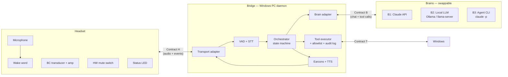

# Project Gemma — System Architecture & Interface Contracts

**Doc 02 of the project series** · *Status: draft for discussion · July 2026*

This is the decision document. It fixes the shape of the system and — most importantly — the three interface contracts that let the remaining work proceed as independent projects. Doc 03 (headset hardware/firmware engineering) and Doc 04 (bridge software engineering) will each build against the contracts defined here without needing to know the other's internals.

Reference back: [Doc 01 — Scoping Study](../01_scoping/01_scoping_study.md).

---

## 1. The core architectural decision

The system splits into three parts joined by two contracts:



Why this shape, restated from our discussion:

- **The headset is deliberately dumb.** Wake event, audio in, audio out, mute state. Everything intelligent lives on the PC. This is the split every shipping AI wearable uses, and it means the headset hardware project (Doc 03) and the software project (Doc 04) cannot block each other.
- **Contract H is satisfied by hardware you can buy today.** The stock Shokz (Phase 0 of Doc 01) fulfils it via the "T0 transport" below, so the bridge can be built and finished before any soldering happens.
- **Contract B makes the brain a plug-in.** "Local LLM vs cloud API vs consumer agent" stops being an architectural fork and becomes a config entry. You start with the brain you already know how to code against (Claude API) and add the local brain when you're ready, changing nothing else.

### Decisions fixed by this document

| # | Decision | Choice | Status |
|---|----------|--------|--------|
| D1 | Headset/PC split | Headset = audio I/O + wake only; all intelligence on PC | Decided |
| D2 | Internal audio format | 16 kHz, 16-bit, mono PCM in; 24 kHz mono out | Decided |
| D3 | Brain interface | Chat-completions-style messages + tool calls (adapter per backend) | Decided |
| D4 | First brain | B1: Anthropic Messages API (your existing experience) | Decided |
| D5 | Second brain | B2: local via Ollama/llama-server on the 5080 | Decided — the project's local-first goal |
| D6 | Bridge language | Python 3.12+, asyncio (see §6) | Decided |
| D7 | Tool safety model | Tiered allowlist + spoken confirmation gate + audit log | Decided |
| D8 | Wake phrase | **User-specified**, via a trained keyword-spotting model — not an LLM. The phrase is typed at setup; a tiny acoustic classifier is generated from synthetic TTS samples (openWakeWord notebook on PC; microWakeWord trainer for ESP32) and dropped in as a model file. Changing the phrase = regenerating the model file, no code change. | Decided (mechanism); phrase choice + false-accept testing open |
| D9 | Wake detection location | PC-side in Phase 0–1; on-headset from the wireless build | Provisional |

---

## 2. Contract H — the headset interface

The headset presents exactly this to the bridge, regardless of what the physical device is:

**Headset → Bridge**

| Message | Payload | Notes |
|---------|---------|-------|
| `WAKE` | timestamp, confidence | Only sent when wake detection is on-device; in T0/T1 the bridge detects wake itself |
| `AUDIO` | 16 kHz 16-bit mono PCM, 20 ms frames (640 bytes) | Streamed while session is open (or continuously in T0/T1) |
| `MUTE` | on/off | Reflects the *hardware* switch state; informational — the switch physically cuts the mic regardless |
| `STATUS` | battery %, RSSI | Wireless builds only; every 30 s |

**Bridge → Headset**

| Message | Payload | Notes |
|---------|---------|-------|
| `AUDIO_OUT` | 24 kHz 16-bit mono PCM frames | TTS narration, streamed |
| `EARCON` | earcon id | Headset may store earcon WAVs locally to cut latency; falls back to `AUDIO_OUT` |
| `LED` | idle / listening / thinking / speaking / error | Drives the status LED — the social/privacy signal |
| `VOLUME` | 0–100 | |

**Control channel encoding:** JSON messages over the transport's control path; audio as raw binary frames on the data path. Deliberately boring.

### Transport profiles

The contract is implemented by a transport adapter per device generation. Nothing above the adapter changes.

| Profile | Physical device | Control path | Audio path | Phase (Doc 01) |
|---------|----------------|--------------|------------|----------------|
| **T0** | Stock BT headset (Shokz + dongle) | None — bridge synthesises WAKE/MUTE itself | OS audio device (WASAPI), HFP 16 kHz | Phase 0 |
| **T1** | Wired custom build | None (or GPIO via serial) | USB sound card, 48 kHz | Phase 1 |
| **T2** | ESP32-S3 wireless build | WebSocket (JSON) over Wi-Fi | Binary WS frames or UDP | Phase 2 |
| **T3** | nRF52840 BLE build (Omi-style) | BLE GATT characteristics | Opus over GATT notifications | Alternative Phase 2 |
| **T4** | LE Audio build (nRF5340) | LE Audio control | LC3 isochronous streams | Phase 3, optional |

**T0 detail (this matters because it's first):** the bridge opens the headset's Windows audio endpoints directly, runs wake-word detection on the continuous mic stream on the PC, and treats "wake word heard" as a synthetic `WAKE` event. Hardware mute is the headset's own mute button (or simply distance). Contract H is thus fully exercised from day one, with the physical headset contributing nothing but audio — exactly the point.

---

## 3. Contract B — the brain interface

Every brain is wrapped in an adapter exposing one async interface:

```python
class BrainAdapter(Protocol):
    async def converse(
        self,
        session: Session,           # conversation id, history policy, user prefs
        utterance: str,             # transcribed user speech
        tools: list[ToolSpec],      # Contract T registry, filtered by tier
    ) -> AsyncIterator[BrainEvent]:
        ...

# BrainEvent is one of:
#   TextDelta(text)            — streamed answer tokens → TTS
#   ToolCall(name, args, id)   — orchestrator executes via Contract T, returns result
#   ToolResult(id, result)     — echoed back into the conversation
#   Done(usage)                — turn complete
#   Error(kind, detail)
```

The internal message shape is the chat-completions convention (system / user / assistant / tool-result messages, JSON-schema tool definitions) because it is the de facto interop standard: the Anthropic Messages API, Ollama, llama-server, LM Studio and every serious local runtime map onto it directly.

### The three adapters

**B1 — Anthropic Messages API (build first).** You have built against the Claude API before; this is the shortest path to a working end-to-end system, probably within a day or two of starting Doc 04. Streaming + tool use are first-class in the Messages API; the adapter is ~150 lines. The bridge executes the tool calls (Claude never touches your PC directly — it only *requests* actions, which pass through the Contract T allowlist). Costs pennies per interaction at assistant-utterance sizes. **Trade-off to hold in mind:** utterance text goes to Anthropic — fine for "open Spotify", your call for anything sensitive; the `local_only` session flag (§5) exists for exactly this.

**B2 — Local LLM (build second — this is the project's thesis).** `ollama pull` a Gemma 4 or Qwen3-class model onto the 5080 and point the same adapter machinery at the local endpoint; because Ollama speaks the same protocol, B2 is mostly configuration plus a model-quirks layer (tool-call format tolerance, retry-on-malformed). Everything Doc 01 §6 said about model choice applies. Getting B2 to match B1's tool-calling reliability is where the interesting tinkering lives.

**B3 — Agent CLI (optional experiment).** Pipe the utterance into Claude Code headless (`claude -p --output-format stream-json --resume <session>`); it brings its own agent loop and its own tools (shell, files, MCP servers). Architecturally different: the brain *acts directly* rather than requesting actions through your allowlist, so the safety model shifts to Claude Code's own permission flags (`--allowedTools`). Fastest route to a startlingly capable assistant; the flagged risks are pricing-model changes (Anthropic paused, but may revisit, how SDK usage draws on subscriptions) and weaker interposition. Worth an adapter precisely because the interface makes it a contained experiment.

**Routing (later, cheap):** once B1 and B2 both exist, the orchestrator can route per-request — `local_only` sessions and privileged content to B2, hard reasoning to B1 — with a config-file policy. Not built until both adapters work.

---

## 4. Contract T — tools and the safety gate

One tool registry, defined once as JSON schema, shared by B1 and B2 (B3 excluded — see above). Each tool declares a **tier**:

| Tier | Meaning | Gate | Examples |
|------|---------|------|----------|
| 1 | Read-only | None | what's on my screen, read clipboard, system status, calendar query |
| 2 | Reversible act | Earcon announce | open/focus app, media keys, volume, type text into focused field, set timer |
| 3 | Destructive / consequential | **Spoken confirmation required** ("say confirm") | file delete/move, send message/email, anything with money, shell command |

Rules, carried over from Doc 01 §7 and now binding:

- No raw PowerShell/shell tool in Tiers 1–2. A Tier 3 shell tool may exist behind confirmation, off by default.
- Every tool invocation is written to an append-only audit log (timestamp, transcript, tool, args, result).
- The executor implements tools via Windows UI Automation / `pywin32` / `subprocess` directly, or by fronting **Windows-MCP** — Doc 04 decides per tool; the registry doesn't care.
- Start with ~6 tools (Tier 1–2 only); grow only after a week of daily use without misfires. Tool-calling reliability compounds per step (Doc 01 §6.2), and few good tools beat many flaky ones.

---

## 5. Interaction model

Session state machine (the orchestrator's heart):

```
IDLE ──wake──▶ LISTENING ──end-of-speech──▶ THINKING ──┬─▶ SPEAKING ──▶ follow-up window ──▶ IDLE
                    │                                   └─▶ ACTING (tools) ─▶ earcon ─┘
                    └─ timeout/mute ─▶ IDLE
```

- **Earcon vocabulary** (pre-rendered WAVs, the "ping" half of your original spec): `ack` (wake heard), `working` (thinking >1.5 s), `ok` (tool success), `fail`, `confirm?` (Tier 3 gate), `answer-ready` (long answer available — say "read it" to hear it). Keep them short (<400 ms), distinct, and pleasant at low volume; they are the product's personality.
- **Narration rules:** answers ≤ 2 sentences are spoken automatically; longer answers get `answer-ready` and wait to be invited (avoids the assistant lecturing into your skull). Commands get earcons only unless they fail.
- **Follow-up window:** ~8 s after a response in which speech is accepted without re-waking (mic stays open, LED stays on — honest signalling).
- **Barge-in:** speaking while it narrates stops TTS immediately and treats the speech as new input. Non-negotiable for the thing to feel respectful.
- **Latency targets** (from Doc 01 §6.3, now acceptance criteria): earcon ack < 300 ms from end of speech; first spoken word < 1.5 s (B1) / < 2 s (B2); Tier 2 action executed < 1.5 s.

---

## 6. Bridge platform choice: Python, and why

**Python 3.12+, asyncio, structured as a single daemon.** Reasons, since you asked:

1. **The ecosystem is simply there.** Every component named in Doc 01 — openWakeWord, Silero VAD, faster-whisper, RealtimeSTT/RealtimeTTS, Kokoro, the Anthropic SDK, Ollama clients — is Python-native with mature examples. In any other language you would be writing bindings before writing your product.
2. **Performance is not where you'd think.** The heavy lifting (Whisper, the LLM, TTS) runs in C++/CUDA under these libraries; Python is only the conductor. Latency is won by *streaming and pipelining* (start TTS on the first sentence, fire earcons on events), not by language speed. The ~500 ms voice-to-voice reference build from Doc 01 is Python.
3. **It's the best language to build with AI assistance** — largest training corpus, cleanest for iterating a hobby codebase with Claude at your side, which given your coding background is the realistic development mode.
4. The trade-off is packaging/UI: Python makes drab Windows apps. Answer: don't make one. The bridge runs headless (a tray icon at most, via `pystray`), with a minimal **FastAPI web page** for status, config, transcript history and the audit log. If a polished UI ever matters, it bolts onto the same API without touching the daemon.

ESP32 firmware (Doc 03) is C++/Arduino or ESP-IDF regardless — the headset side was never going to be Python, and Contract H means the two codebases share nothing but the message schema.

---

## 7. Security & privacy posture (binding summary)

- Hardware mic mute switch on every custom build; LED states are truthful (LED on ⇔ audio leaving the device).
- Wake-word gating: raw audio is discarded unless a session is open (T0 necessarily streams to the PC continuously, but the *bridge* buffers and discards; nothing is written to disk until triggered).
- No audio retention: transcripts kept in a local log you can purge; raw audio never stored beyond the rolling buffer.
- `local_only` session flag: forces B2, refuses B1/B3 — the "privileged content" switch, one utterance away ("private mode").
- Tiered tools + confirmation + audit log per §4. Bridge runs under your normal account initially; a limited Windows account is the hardening step once Tier 3 tools exist.
- Prompt-injection stance: assume any content the brain reads (web, files) is hostile; the allowlist and Tier 3 gate are the defence, not model cleverness.

---

## 8. Milestones (mapping onto Doc 01's phases)

| Milestone | Contents | Depends on | Acceptance test |
|-----------|----------|------------|-----------------|
| **M0 — Loop closed** | Bridge skeleton: T0 transport, wake (openWakeWord), VAD, faster-whisper, **B1 Claude adapter**, earcons, Kokoro TTS. Zero tools. | Stock headset (Phase 0 buy) | Wake → ask a question → hear a spoken answer, < 2 s, ten times in a row |
| **M1 — It acts** | Contract T registry + executor; 6 starter tools (Tier 1–2); audit log; follow-up window; barge-in | M0 | "Open Spotify and play something" works via earcon ack; audit log shows the calls |
| **M2 — It's local** | B2 Ollama adapter + model bake-off on the 5080; `local_only` flag; routing config | M0 (parallel to M1) | Same M1 script passes with Wi-Fi unplugged |
| **M3 — It's on your head** | T2 transport + ESP32 headset from Doc 03; on-device wake; LED/mute wired to contract | M1, Doc 03 build | Full loop on custom hardware, battery > 4 h |
| **M4 — Experiments** | B3 agent-CLI adapter; bone-conduction mic; T3/T4 transports; per-request routing | M2/M3 | Each is its own writeup in the doc series |

M0 is genuinely close: with B1 as the brain and the stock headset as the device, it is glue code around mature libraries — a focused weekend with Claude Code at your elbow.

---

## 9. Open questions (to resolve in 03/04 or by experiment)

1. **Wake phrase.** Mechanism decided (D8: trained keyword model, user-specified phrase). Remaining: which phrase — longer/3+-syllable phrases false-trigger far less ("Hey Gemma" beats "Gemma") — and false-accept testing in your actual rooms. Note the detector never does language understanding; it is an acoustic pattern-matcher in front of the pipeline, which is what keeps always-listening cheap and private.
2. **STT choice at M0**: faster-whisper `large-v3-turbo` vs `small.en` — start big (the 5080 doesn't care), measure, shrink if pointless.
3. **Earcon design**: synthesise, buy a pack, or generate? (Genuinely fun sub-project.)
4. **Follow-up window length and LED semantics** — feel, not engineering; tune in M0.
5. **Whether B2's default model is Gemma-family** (thematic, audio-native option per Doc 01 §6.2) **or Qwen-family** (tool-calling reputation) — the M2 bake-off answers this.
6. **Dual-GPU split** (5080 = LLM, spare 5070 Ti = STT/TTS in a second box or slot) — decide at M2 when VRAM pressure is real rather than theoretical.

---

## 10. What Docs 03 and 04 will contain

**Doc 03 — Headset engineering:** part-by-part electrical design for the T1 wired and T2 wireless builds (schematic-level), ESP32-S3 firmware structure (I2S in/out, microWakeWord, Wi-Fi streaming, power management), the teardown/salvage plan from Doc 01 §4 turned into build steps, enclosure/band mechanics, battery sizing, and the T2 transport implementation of Contract H.

**Doc 04 — Bridge engineering:** repo layout, module-by-module design (transport adapters, orchestrator, brain adapters, tool executor, audio pipeline), the six starter tools specified, config schema, the FastAPI status page, test strategy (including a replay harness: recorded WAV in → expected behaviour out), and the M0 build order as a working checklist.

*Next actions: agree/amend the decisions table (§1) and the earcon/narration rules (§5) — then 03 and 04 can be drafted, and M0 can start as soon as the Phase 0 headset arrives.*
