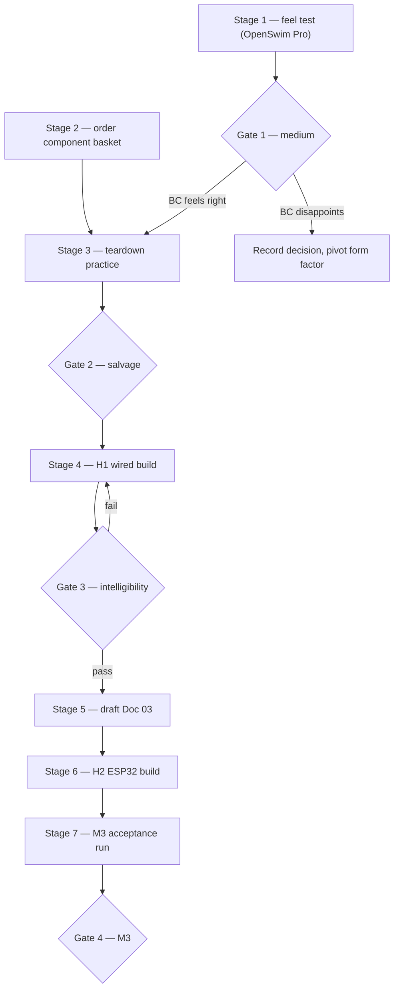

# Doc 03a — Track H plan of action (headset hardware)

**Status: DRAFT — not yet frozen.** On Thomas's sign-off this becomes a frozen decision
record (hard rule 2 applies from that commit). Live build status: [STATE.md](../../STATE.md)
Track H — this file never states how built anything is. Interface truth:
[spec/10_contract_h.md](../../spec/10_contract_h.md). Milestone definitions:
[spec/00_overview.md](../../spec/00_overview.md).

Drafted 2026-07-14 from docs/01 §§4–5, 9–11 (scoping), spec/00 (M3 definition), and
Contract H v0.2.0. Doc 03 proper — the headset *engineering* doc (electronics, firmware,
enclosure design) — is **produced by Stage 5 of this plan**, not replaced by it.

## 1. What this plan is for

At drafting time (2026-07-14) Track H had nothing built — see STATE for what is true
now. The destination is **M3 — "On your head"**: the
full voice loop running on a custom ESP32 headset (H2 profile), wake word detected
on-device, battery life over 4 hours. This plan orders the work between here and there
as seven stages with four explicit decision gates — points where a real-world outcome
(how bone conduction feels, whether a £7 transducer is intelligible) changes the path.
Stages are numbered 1–7 to avoid colliding with docs/01's purchase "Phases 0–2" and the
project's track letters; the mapping to docs/01 is given per stage.

Out of scope, deliberately: H3 (BLE) and H4 (LE Audio) transports, the bone-conduction
*microphone* experiment, and LE Audio hardware generally — all parked (STATE, Parked
list; docs/01 §10 calls the v2 firmware cliff "its own hobby").

## 2. The route at a glance

Stage 2 runs in parallel with Stage 1 — parts have lead time, and delivery time is free
cover for Track G work (STATE already says this). Everything else is sequential.

## 3. The stages

### Stage 1 — Feel and benchmark (unit acquired at drafting; wear test pending)

*docs/01 mapping: Phase 0 (adapted — see purchase decision below, not a new OpenComm2).*

Decided during drafting (2026-07-14): the Stage 1 unit is a **Shokz OpenSwim Pro**
(Bluetooth 5.4 with a confirmed call microphone, ~9 h BT battery, IP68 + 32 GB MP3
mode). Chosen over the cheapest-used-Shokz option because it fills the one genuine gap
in Thomas's existing audio kit — swimming — while doing every project duty. The
reasoning that made this safe: for a *speech* assistant, any competently tuned Shokz
sits close enough to the medium's ceiling to calibrate Gate 1; the flagship (OpenRun
Pro 2) margin lives in music bass and music-volume leakage, dimensions Gemma never
uses. The swim premium is attributable to swimming, not the project.

Wear it for real listening; once Track G's M0 loop closes, run it as the H0 device
(startup check: the Windows Hands-Free endpoint must report 16 kHz — spec/10 §3).
This is three things at once: a guaranteed-true bone-conduction feel test, the quality
benchmark that calibrates expectations for every DIY build after it (docs/01 §4.2 says
keep one intact Shokz for exactly this), and the daily H0 device. It is **never** a
teardown donor — its IP68 sealing makes it the worst possible candidate anyway; the
Stage 3 generic is the sacrifice.

**Gate 1 — the medium gate.** *Does bone conduction feel right for daily assistant
use?* Judge after at least a week of real wear: comfort of clamping pressure, speech
intelligibility at desk and while moving, the social feel of open ears.

- **Yes** → proceed as planned.
- **Tolerable but flawed** → note the specific flaw (pressure? bass? placement
  sensitivity?) and carry it into Stage 4 as a thing to iterate on. Proceed.
- **No** → stop and record a decision (D-number in spec/00). The realistic pivot is
  open-ear micro-speakers in the same nape-pod architecture — everything in this plan
  except the transducers (~£25 of the basket) survives that pivot, and the OpenSwim
  Pro keeps its swim job regardless. Contract H is form-factor-agnostic and does not
  change at all.

### Stage 2 — Order the component basket (do early, runs in parallel)

*docs/01 mapping: §11 shopping list, adapted.*

Order now rather than after Gate 1: lead time is dead time, and the basket is mostly
medium-agnostic (amps, mics, ESP32s, LiPo kit all survive a Gate 1 pivot). Adapted from
docs/01 §11:

| Item | Qty | Approx. | Stage used |
|------|-----|---------|-----------|
| Generic BC headset (teardown donor — check reviews for *true* BC) | 1 | £30 | 3 |
| Adafruit #1674 bone conductor | 2 | £14 | 4, 6 |
| Dayton Audio BCE-1 (comparison transducer) | 1 | £11 | 4 |
| PAM8302 mono analog amp | 1 | £3 | 4 |
| MAX98357A I2S amp breakout | 2 | £9 | 6 |
| Seeed XIAO ESP32-S3 Sense | 2 | £28 | 6 |
| ICS-43434 (or INMP441) I2S microphone | 2 | £8 | 6 |
| USB-C sound card | 1 | £10 | 4 |
| Lavalier electret microphone | 1 | £12 | 4 |
| 1200 mAh LiPo + charger board + LiPo-safe bag | 1 set | £20 | 3 (safety), 6 |
| Slide switch (hardware mute), LED, wire, heatshrink, Sugru | — | £15 | 4, 6 |
| Plastic spudger set + fine knife | 1 | £8 | 3 |

≈ **£170**. Deliberately dropped from docs/01 §11: the new Shokz OpenComm2 UC (£160) —
the OpenSwim Pro covers benchmark and H0 duty; whether a boom-mic Shokz is still wanted
as a daily driver is a post-Gate-1 comfort decision, not a plan dependency.

Also acquire if not owned: a basic soldering iron + solder + practice kit (~£25), a
cheap multimeter (~£12). Budget line, but more importantly a *skills* line — Stage 4 is
designed to be the low-stakes place to learn to solder.

### Stage 3 — Teardown practice

*docs/01 mapping: Phase 1, first half. Safety protocol: docs/01 §4.1 — read it first.*

Dissect the £30 donor: learn the glue, find the cell, extract the transducers and
sprung band. **This is the one genuinely hazardous step in the project** — the LiPo
pouch is glued against the case wall. Full discharge first, plastic tools near the
cell, non-flammable surface, LiPo bag within reach.

**Gate 2 — the salvage gate.** *Did usable transducers and a wearable band survive?*
This gate never blocks the path — it only selects parts. Good salvage → the Stage 6
enclosure is a printed pod on the donor band, and donor transducers join the Stage 4
comparison. Wrecked salvage → Stage 6 uses the Adafruit/Dayton parts and an off-the-shelf
or printed band; note what the teardown taught anyway.

### Stage 4 — H1 wired build

*docs/01 mapping: Phase 1, second half (the "v1" build, §5.2). Contract H profile: H1.*

USB sound card + lavalier mic + PAM8302 + transducer on a headband. Full 48 kHz duplex,
no battery, no radio, no firmware — every hard variable removed except the two that
matter: *can a bare transducer against your skull produce intelligible assistant
speech, and where must it sit?* Compare all transducers on hand (Adafruit, Dayton,
donor salvage). H1 needs no transport adapter — like H0, the bridge sees OS audio
endpoints (Contract H §3), so Track G code is untouched.

**Gate 3 — the intelligibility gate.** *Clear TTS speech at comfortable, sustainable
clamping pressure?*

- **Pass** → the physics of the whole project is proven; proceed.
- **Fail** → iterate within the stage: placement (mastoid vs cheekbone), pressure,
  the other transducers, more amp drive (docs/01 §4.3: 100–500 mW pressed against bone
  should suffice). A persistent fail reopens Gate 1's pivot option — but with evidence.

### Stage 5 — Draft Doc 03 (headset engineering)

Written *after* Stages 3–4 on purpose: the design doc should encode measured facts
(which transducer, what placement, what pressure) rather than guesses. Doc 03 covers:
electronics (XIAO ESP32-S3 Sense + ICS-43434 + MAX98357A + chosen transducer), firmware
architecture (microWakeWord on-device; Contract H §3 H2 profile — WebSocket JSON
control + binary WS audio frames; HELLO/version rules of Contract H §4), power budget
and wake-gating strategy (STREAM off = radio asleep, the battery-life mechanism,
Contract H §2), hardware mute switch and LED (spec/50 rules 4–5 — physical mic cut,
truthful LED), and the enclosure (nape pod on the salvaged or substitute band).
Freezes on commit, like docs/01–04.

### Stage 6 — H2 build

*docs/01 mapping: Phase 2 (the "v1.5" build, §5.2). Contract H profile: H2.*

Build order within the stage, each step testable on its own:

1. **Bench bring-up** — breadboarded XIAO + mic + amp + transducer; sanity-check audio
   in and out locally, no radio.
2. **Firmware speaks Contract H** — HELLO handshake, AUDIO streaming at 16 kHz/20 ms
   frames, STREAM gating, EARCON/LED handling, per spec/schemas/messages.schema.json.
3. **Bridge-side transport adapter** (`bridge/transports/`) — this is Track G code and
   the first real test of Contract H's promise that nothing above the adapter knows
   which transport is live. Coordinate in STATE across both tracks.
4. **On-device wake** — microWakeWord with the user phrase; WAKE message replaces the
   bridge's PC-side synthesis.
5. **Power** — LiPo + charger, wake-gated radio; measure real battery life (docs/01
   §10: gating is the difference between 4 hours and a working day).
6. **Enclosure** — 3D-printed nape pod on the band; mute switch and LED mounted.
   Requires print access: local print service, library/makerspace, or buying a small
   printer — decide when the pod design exists, not before.

### Stage 7 — M3 acceptance run

Run the M3 test as defined in spec/00: full wake→answer loop on the H2 headset,
on-device wake, battery > 4 h of realistic use. **Gate 4 — the acceptance gate**: pass
→ M3 closes, STATE Track H collapses to a summary, and what's next is M4 experiment
territory (parked list). Shortfalls → each maps to a Stage 6 step to revisit (battery →
gating, wake accuracy → model retraining, audio dropouts → transport/UDP fallback per
Contract H §3).

## 4. Cross-track dependencies

| Dependency | Direction | Note |
|-----------|-----------|------|
| M0 loop closed (Track G) | needed before Stage 1's H0 duty and all of Stage 7 | Stages 2–5 don't need it — hardware work is the mood-hop option while G rests |
| Transport adapter (Stage 6.3) | Track H drives, Track G codebase | The one place the tracks genuinely interlock; keep both STATE entries pointing at it when live |
| Contract H v0.2.0 | interface for Stage 6 firmware | Schema changes bump minor version (Contract H §4); firmware must ignore unknown message types |
| M0.5 voice-output contract (Track B) | none | Purely bridge/brain-side; no hardware coupling |

## 5. Budget summary

| | |
|---|---|
| Stage 1 (Shokz OpenSwim Pro, acquired) | ~£199 |
| Stage 2 basket | ~£170 |
| Tools (iron, multimeter) if not owned | ~£37 |
| Stage 6 printing (service or share of a printer) | ~£10–40 |
| **Core path total** | **~£415–445** |

Sits above docs/01 §9's ~£295+consumables core-path figure by the OpenSwim Pro premium
over a used OpenRun — accepted deliberately because the premium buys the swim niche,
which stands on its own regardless of the project. Every stage's spend survives the
later stages (docs/01 §9 principle: no phase strands the previous phase's money).

## 6. Risks carried into this plan

From docs/01 §10, the ones that bite Track H specifically: fake "bone conduction"
donors that are really micro-speakers (check reviews before the Stage 2 order) · LiPo
puncture during teardown (Stage 3 protocol) · ESP32 battery life without wake-gating
(Stage 6.5 measures it) · thin bass and placement sensitivity are *properties of the
medium*, not defects — the intact Shokz is the calibration reference · the social
factor: mute switch and LED are commitments (spec/50), not decorations.
