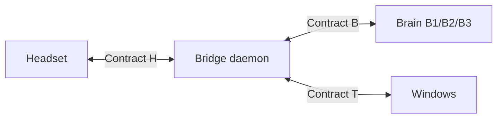

# Spec 00 — System overview & status

**Status: DESIGNED (no code)** · Last reconciled: 2026-07-10 · Decisions record: [docs/02](../docs/02_architecture/02_system_architecture.md)

## The system in one paragraph

A head-worn unit (bone-conduction output, microphone, wake-word detection, radio —
deliberately dumb) talks over **Contract H** to the **bridge**, a Python daemon on the
hub machine (Windows PC or Mac — D10). The bridge transcribes speech, sends it through **Contract B** to a
swappable brain (B1 Claude API → B2 local LLM → B3 agent CLI), executes any requested
PC actions through the **Contract T** tool registry with tiered safety gates, and
replies with earcons (instant pings) or streamed TTS narration.

## Component inventory

| Component | Spec | Code location (future) | Status |
|-----------|------|------------------------|--------|
| Headset hardware (T0 stock → T2 ESP32) | [10_contract_h](10_contract_h.md) | `firmware/` | DESIGNED — Doc 03 pending |
| Transport adapters | [10_contract_h](10_contract_h.md) §3 | `bridge/transports/` | DESIGNED |
| Audio pipeline (wake, VAD, STT, TTS, earcons) | [40_interaction](40_interaction.md) | `bridge/audio/` | DESIGNED |
| Orchestrator (state machine) | [40_interaction](40_interaction.md) | `bridge/orchestrator.py` | DESIGNED |
| Brain adapters | [20_contract_b](20_contract_b.md) | `bridge/brains/` | DESIGNED |
| Tool registry + executor | [30_contract_t](30_contract_t.md) + [schemas/tools.json](schemas/tools.json) | `bridge/tools/` | DESIGNED |
| Security posture | [50_security](50_security.md) | cross-cutting | BINDING |

## Milestones

| Milestone | Definition (acceptance test) | Status |
|-----------|------------------------------|--------|
| **M0 — Loop closed** | Wake → question → spoken answer < 2 s, ×10 consecutively; stock headset (T0), B1 brain, zero tools | not started |
| **M1 — It acts** | "Open Spotify and play something" → earcon ack; audit log shows the calls; 6 starter tools | not started |
| **M2 — It's local** | M1 script passes with Wi-Fi unplugged (B2 brain) | not started |
| **M3 — On your head** | Full loop on custom ESP32 headset (T2), on-device wake, battery > 4 h | not started |
| **M4 — Experiments** | B3 adapter · bone-conduction mic · T3/T4 · per-request routing | not started |

## Fixed platform decisions

Python 3.12+ / asyncio for the bridge (rationale: docs/02 §6). ESP32-S3 + C++ for the
T2 headset. Audio: 16 kHz 16-bit mono PCM in, 24 kHz mono out (constants in
[schemas/messages.schema.json](schemas/messages.schema.json)). Wake word: user-specified
phrase → trained keyword model (openWakeWord on PC; microWakeWord on ESP32) — never an
LLM, never continuous transcription.

**D10 (2026-07-10): cross-platform hub.** The bridge targets **Windows 11 and macOS as
full peers** (Thomas runs a Windows/RTX-5080 desktop and a Mac laptop; an M4/M5-class
Air can also run B2 locally via Ollama/Metal). Platform-specific code is confined to
exactly two seams: audio endpoint access and the Contract T tool-executor backends
(spec/30 rule 3). Everything else — orchestrator, brains, transports, schemas — is
platform-neutral by construction. Windows is the reference platform (built and tested
first); macOS parity is checked at each milestone, not retrofitted at the end.
Portability design: docs/04 §3.
