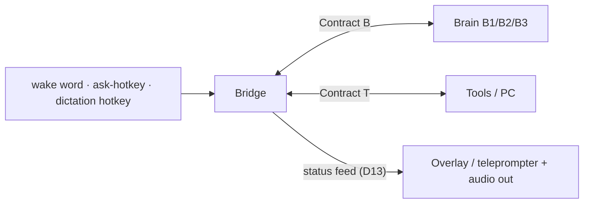

# Spec 00 — System overview & status

**Last reconciled: 2026-07-21** · Build progress: [STATE.md](../STATE.md) · Decisions record: [docs/02](../docs/02_architecture/02_system_architecture.md)

## The system in one paragraph

Gemma is a desk assistant: the **bridge** (**G**), a Python daemon on the hub machine
(Windows PC or Mac — D10), with two front doors and two faces (D16). Front doors: a
global **ask-hotkey** and a **wake word** open the same assistant loop — speech → STT →
**Contract B** to a swappable brain (B1 Claude API → B2 local LLM → B3 agent CLI) →
answer; a second hotkey runs **dictation** (speech → transcript → transform → paste
into the focused app, Track D). Faces: a Dynamic-Island-style **overlay** (the
teleprompter — a separate process on the status feed, D13/D14) and **audio** (earcons +
TTS) — redundant by design at the desk, audio alone sufficing away from the screen.
Requested PC actions run through the **Contract T** tool registry with tiered safety
gates (M1).

## Legend — naming scheme

One letter per element. The **bridge (G)** is the hub; **B/T/P** are the things it
connects to, each over the matching Contract.

| Letter | Element | Contract | Component IDs |
|--------|---------|----------|---------------|
| **G** | Bridge — the Gemma daemon (audio, wake, STT, TTS, orchestrator) | — (it *is* the hub) | build steps 0–7 |
| **B** | Brain — swappable LLM | Contract B | **B1** Claude · **B2** local · **B3** CLI |
| **T** | Tools — registry + executor + PC actions | Contract T | safety **Tier 1–3** |
| **P** | Teleprompter — on-screen overlay (separate process) | Contract P | status feed ([schemas/status.json](schemas/status.json)) |

Orthogonal axes: **milestones M0–M4** (project-wide stages — see below) and the frozen
**decision records docs 01–04**. Milestone *definitions* live in this file; the live
per-track *sub-steps* live in `STATE.md`; the frozen M0 build order is in docs/04 §8.

> **Terminology note (old → current).** The frozen docs/01–04 use earlier names and are
> not retro-edited (hard rule 2). Current truth: STATE.md tracks relettered **A→G**
> (Bridge), **C→B** (Brain), with a new **T** (Tools) track — so "Track A's queue" in
> docs/04 §8 is now Track G's.

## Component inventory

| Component | Spec | Code location | Lands at |
|-----------|------|---------------|----------|
| Hotkey triggers (ask-Gemma · dictation) | [40_interaction](40_interaction.md) + 60_dictation (owed) | `bridge/hotkeys/` | ask pre-M0-run (D16) · dictation at D1 |
| Audio pipeline (wake, VAD, STT, TTS, earcons) | [40_interaction](40_interaction.md) | `bridge/audio/` | M0 |
| **Teleprompter** (P) — overlay, separate process on the status feed | [40_interaction](40_interaction.md) § Visual output | `teleprompter/` | v0 pre-M0-run (D13/D19) · dictation states at D2 |
| Orchestrator (state machine) | [40_interaction](40_interaction.md) | `bridge/orchestrator.py` | M0 (build step 6) |
| Brain adapters | [20_contract_b](20_contract_b.md) | `bridge/brains/` | B1 at M0 · B2 at M2 · B3 at M4 |
| Tool registry + executor | [30_contract_t](30_contract_t.md) + [schemas/tools.json](schemas/tools.json) | `bridge/tools/` | M1 |
| Security posture | [50_security](50_security.md) | cross-cutting | always (BINDING) |
| Dictation (hotkey → transform → paste) | 60_dictation (owed — drafted after the M0 run) | `bridge/dictation/` | MD |

## Milestones

Definitions only — live progress per track is in [STATE.md](../STATE.md).

| Milestone | Definition (acceptance test) |
|-----------|------------------------------|
| **M0 — Loop closed (desk-shaped, D16)** | Ask-hotkey → question: response streams to the overlay **and** speech; perceptible feedback < 1.5 s (D11/D16), first spoken word < 4 s, ×10 consecutively · wake-word variant ×3 with the spoken path carrying alone · B1 brain, zero tools |
| **M0.5 — It speaks well** | A 10-prompt bank (factual · complex · list-shaped · tool-result) each renders voice-correctly *without* the sentence-count heuristic: short answers spoken whole, long → spoken TL;DR + held detail, no markdown/emoji/URL reaches TTS, numbers/units read naturally. A model-driven output contract replaces spec/40's ≤2-sentence stopgap; adapter-agnostic (B2-tolerant parse). |
| **M1 — It acts** | "Open Spotify and play something" → `awake` earcon; audit log shows the calls; 6 starter tools |
| **M2 — It's local** | M1 script passes with Wi-Fi unplugged (B2 brain) |
| **MD — It types** *(feature milestone, parallel to the M-ladder)* | Hotkey → dictated speech lands in the focused app: ×10 consecutive dictations across ≥3 apps paste correctly after cleanup, zero answer-instead-of-transcript failures; capture in RAM; assistant loop unaffected |
| **M4 — Experiments** | B3 adapter · per-request routing |

## Fixed platform decisions

Python 3.12+ / asyncio for the bridge (rationale: docs/02 §6). Audio: 16 kHz 16-bit mono
PCM in, 24 kHz mono out (constants in [schemas/audio.json](schemas/audio.json)). Wake
word: user-specified phrase → trained keyword model (openWakeWord) — never an LLM, never
continuous transcription. STT: faster-whisper (`small.en`), GPU where
available (CUDA on the RTX-5080 host; CPU on Mac until a Metal engine is added).

**D10 (2026-07-10): cross-platform hub.** The bridge targets **Windows 11 and macOS as
full peers** (Thomas runs a Windows/RTX-5080 desktop and a Mac laptop; an M4/M5-class
Air can also run B2 locally via Ollama/Metal). Platform-specific code is confined to
exactly two seams: audio endpoint access and the Contract T tool-executor backends
(spec/30 rule 3). Everything else — orchestrator, brains, transports, schemas — is
platform-neutral by construction. Windows is the reference platform (built and tested
first); macOS parity is checked at each milestone, not retrofitted at the end.
Portability design: docs/04 §3.

**D11 (2026-07-12): feedback-first latency posture.** The system guarantees fast
*feedback*, not fast *answers*. Every turn class produces something audible within
**1.5 s** of end-of-speech (the first spoken word, or the `working` earcon). A no-tool
conversational answer must then start speaking within **4 s** (B1) / **5 s** (B2) —
provisional numbers pending the owed measurements (STATE: step-3 live mic test, B1
first-token re-run). A tool-running turn is acknowledged within the same 1.5 s but has
**no completion bound** — it finishes when it finishes and signals with the
`task-complete`/`error` earcon. Consequences: TTS stays **generate-then-play** for
M0/M1 (sentence-streamed TTS parked; reopen only if measured use feels slow); spoken
tool-progress narration is config-gated, **default off** (`working` ping, then silence —
the PC overlay carries continuous state). Clock definition in spec/40. No "complex task
mode": long-running work is a property of the turn the orchestrator observes (ToolCall
events), never a spoken mode the user must remember to enter or exit.
*(Amended by D16: "audible feedback" is now "perceptible feedback" at the desk —
earcon, first spoken word, or overlay state change; audible alone must still satisfy
the guarantee away from the screen.)*

**D12 (2026-07-18): dictation joins as an assistant-internal feature.**
The project re-centres on bridge + brain + tools: audio I/O runs on commodity gear
(IEMs + built-in/desk mic). **Dictation** becomes a first-class feature *within* the
assistant (the assistant remains primary): a global hotkey (hybrid — tap = toggle, hold
= push-to-talk) triggers capture → STT → LLM cleanup ("transform, never answer") →
clipboard-paste into the focused app. **Trigger-is-the-mode:** the wake word always
means assistant, the hotkey always means dictation — no spoken mode-switching, no intent
inference. The paste is
deterministic post-processing, never a Contract-T tool — the model cannot invoke it;
only the user's keypress does. Capture stays in RAM (spec/50 rule 3 unchanged). Full
behaviour spec: `spec/60_dictation.md` (owed — drafted after the M0 acceptance run,
sequencing decided 2026-07-18). Design study:
[Review — Gemma & VoiceInk codebases](../docs/01_scoping/Reviews/2026-07-18_1643_Review-gemma-voiceink-codebases.md).

**D13 (2026-07-18): overlay architecture — a separate process on a status feed.** The
PC overlay (spec/40 § Visual output) runs as its **own process**, never inside the
daemon: the orchestrator broadcasts JSON status events — state transitions,
partial/final transcript, mic level, per-turn latency — over a **localhost-only**
socket, and the overlay is a dumb subscriber rendering whatever arrives. Rationale:
crash isolation (overlay death never touches the voice loop) · no GIL contention
between repaints and audio/STT · renderer swappability. Its listening indicator inherits
spec/50's truthful-indicator rule. The feed's message schema lands in `spec/schemas/` at
build (hard rule 3).
Renderer: **PySide6/Qt** on Windows — frameless, translucent, and **non-activating
(BINDING, spec/40)**: the overlay must never take focus, because during dictation focus
determines where the paste lands. A later mac renderer consumes the same feed. Build
order: overlay v0 (state · live transcript · latency readout) lands **before the M0
acceptance run** as its instrument; dictation states at Track D's D2.

**D14 (2026-07-20): the assistant at the desk — teleprompter overlay, third trigger,
in-memory history.** With H parked (D12) the desk is the primary context, and the
overlay graduates from supplement to **first-class surface at the desk**: a
teleprompter rendering the transcribed prompt, the brain's response as it streams
(text deltas), and tool activity — expandable to the full current-session turns.
**Eyes-free is demoted, not deleted:** away from the screen, earcons and TTS alone
must still fully carry the experience (spec/40 amended). **Third trigger — the ask-Gemma hotkey** (push-to-ask): trigger-is-the-mode
survives because each trigger still means exactly one thing — wake word = assistant
hands-free · dictation hotkey = dictation · ask hotkey = assistant push-to-ask. At the
desk the ask hotkey will likely dominate the wake word (instant, zero false-accepts);
the wake word's constituency is away-from-desk — accepted
knowingly. **History: in-memory only** — the expandable view shows the current
session's turns from RAM; nothing is written to disk (spec/50 unchanged); revisit only
if real use demands recall across restarts. Rendering reality: the response side can
teleprompter-scroll from day one (brain deltas already stream); the prompt side
appears as a block at end-of-speech until streaming STT (deferred) exists.

**D15 (2026-07-20): prompt hygiene — shared word-replacement; LLM cleanup as a gated
experiment.** A **deterministic word-replacement layer** (user-curated find-and-replace
table for known STT mishearings — names, jargon; word-boundary matching, longest match
first) runs on every transcript in **both** paths: before `transform` in dictation,
before the brain in the assistant loop. Microsecond cost, no model, fixes only what
it's taught; the table lives in `spec/schemas/` (hard rule 3, schema owed at build).
Separately, **`--clean-prompts`** (config flag, **default off**): the assistant path
may pass the transcript through `transform()` ("fix transcription errors and restore
structure only; change nothing else") before the brain — motivation: long composed
prompts arrive as rambles. Runs **per-prompt**, never per-sentence (self-corrections
span sentences; batch STT yields no early sentences anyway; the incremental-clean
option opens only if streaming STT lands). Engine: a small local model once the Ollama
groundwork (Track B) exists — not the cloud brain. Judged empirically: cleanup gets
its own row in the per-turn latency table, and an A/B on ~20 real transcripts (raw vs
cleaned → compare brain answers) decides default-on or delete. D11's bounds apply to
the flag-off path; flag-on latency is precisely what the experiment measures. The
overlay shows raw → cleaned whenever the flag is on (D14 teleprompter).

**D16 (2026-07-20): re-founding — the desk product.** Adversarial review of the
accumulated D12–D15 patches against the original eyes-free spec; every survivor below
survives by re-affirmation, not inertia. Rulings: **(1) Both, always.** At the desk
every answer streams to the overlay **and** is spoken (barge-in intact) — redundant by
design: glance or listen. Away from the screen, audio alone must still carry (D14).
Amends D11 as noted there. **(2) Desk-shaped M0.** The acceptance test now matches the
product: ×10 ask-hotkey turns with overlay streaming + speech, plus a ×3 wake-word
variant proving the spoken path carries alone. Consequence: the ask-hotkey (and the
shared hotkey module) builds **before** the acceptance run — reversing D14's ordering;
Track D's D1 now reuses Track G's hotkey plumbing, not vice versa. **(3) Re-affirmed on
merit:** the capture stack (wake/VAD/whisper — both doors and dictation stand on it) ·
OutputPump's BT keep-alive (any Bluetooth audio) · spec/50 invariants · Contracts B/T ·
the wake word as the hands-free/away door, knowing the ask-hotkey will dominate at the
desk. Nothing else from the eyes-free era binds the desk product.

**D17 (2026-07-20): rewrite mode in principle; interaction-consolidation gate before
Track D.** Field use of VoiceInk (review: docs/01_scoping/Reviews, 2026-07-20)
surfaced a third interaction format Gemma lacked: **rewrite** — select text in any
app, invoke, speak an *instruction* ("make this firmer and halve it"), and the
selection is replaced by the transformed text. Adopted **in principle** as a Track D
slice (D3, after dictation works): selection capture via simulated Ctrl+C round-trip
(Windows) · spoken utterance = the instruction, selection = the content ·
`transform()` with a rewrite-ladder contract (selection → instruction+text →
bare text; see the review §3) · delivery = paste over the selection, user-initiated —
the D12 boundary holds, the model never chooses to paste. **Gate (binding on Track
D):** before any Track D build begins, a dedicated **interaction-consolidation
review** answers "how exactly does a user interact with Gemma?" The trigger inventory
has grown piecemeal — wake word · ask-hotkey · dictation hotkey · proposed rewrite
trigger; VoiceInk ships three unique shortcuts for its three functions, and
alternatives are open (one key + modifiers · press-patterns · selection-presence
switching a shared key · a radial/pill menu on the overlay). Terms of the review:
mode selection stays **deterministic** — no intent inference, the D12 invariant — but
the *mapping* of gestures to modes is open, including revisiting how many distinct
keys exist. Output: a consolidated trigger scheme recorded as its own D-number and
encoded in `spec/60_dictation.md` (which is drafted only after the review).

**D18 (2026-07-20): Contract H excised — the custom headset is cancelled, not parked.**
The "do I actually want to build this" test (D12's stock-hardware-first plan) came back
negative: AirPods and IEMs deliver excellent audio, so the custom bone-conduction
headset isn't worth building. **Contract H, the H0–H4 ladder, the transport adapters, the
M3 milestone, and all attendant language are removed from current truth** — the design is
preserved in git history + the frozen docs/01–04 if ever revived. Supersedes the headset
halves of D12 (parking → cancellation), D13 ("a second headset made of pixels"), and D16
((3) parked banner). Survivors the desk product inherited stay, reframed: the audio
format constants (16 k / 24 k) moved from the deleted `messages.schema.json` to
`spec/schemas/audio.json` (loaded by `wake.py` / `speak.py`); `earcons.json` (the bridge
plays them); spec/50's truthful-indicator rule (now the overlay's indicator, not an LED);
OutputPump's BT keep-alive (any Bluetooth audio); push-to-talk (now the hotkey).
`spec/10_contract_h.md` and `messages.schema.json` are deleted; audio stays commodity
(AirPods / IEMs / desk mic).

**D19 (2026-07-21): the Teleprompter formalised — component P, Contract P, front/back
split.** The on-screen overlay is named the **Teleprompter** and lettered **component P**
in the naming scheme (legend above); the localhost status feed it subscribes to is
**Contract P** (`spec/schemas/status.json`). Architecture (D13 restated as a contract):
the system splits front/back. The **back-end** is the headless `bridge/` daemon, which
owns a **crash-isolated broadcaster** (`bridge/broadcaster.py`) publishing Contract-P
messages as NDJSON over a localhost-only TCP socket (127.0.0.1, the docs/04 §5 reserved
port 8990). The **front-end** is a new top-level **`teleprompter/`** package (PySide6 +
QML) — a dumb subscriber that renders whatever arrives and never drives the voice loop.
**Crash-isolation is by construction:** the broadcaster's `publish()` never blocks and
never raises, and a busy port just disables the feed, so a slow, absent, or dead overlay
(or the broadcaster itself) can neither stall nor crash the orchestrator. The always-up
daemon is the server; the overlay is the reconnecting client. Contract P gains an
**`error`** message (`kind` + human-facing `message`) so the surface can explain a fault,
not merely flag it. Secrets stay provider-scoped in the OS credential store (spec/50 rule
10): the tray's cleanup-engine field writes the Groq key under `("gemma","groq")` —
per-role provider *routing* is a later concern (STATE Parked/someday), kept out of the key
name. Supersedes the `bridge/ui/` code-path (now `teleprompter/`) in the component
inventory and spec/40. Build sequence and progress: STATE Track P.
