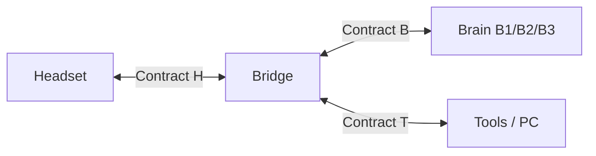

# Spec 00 — System overview & status

**Last reconciled: 2026-07-12** · Build progress: [STATE.md](../STATE.md) · Decisions record: [docs/02](../docs/02_architecture/02_system_architecture.md)

## The system in one paragraph

A head-worn unit (bone-conduction output, microphone, wake-word detection, radio —
deliberately dumb) talks over **Contract H** to the **bridge** (**G**), a Python daemon on the
hub machine (Windows PC or Mac — D10). The bridge transcribes speech, sends it through **Contract B** to a
swappable brain (B1 Claude API → B2 local LLM → B3 agent CLI), executes any requested
PC actions through the **Contract T** tool registry with tiered safety gates, and
replies with earcons (instant pings) or streamed TTS narration.

## Legend — naming scheme

One letter per element. The **bridge (G)** is the hub; **H/B/T** are the three things it
connects to, each over the matching Contract.

| Letter | Element | Contract | Component IDs |
|--------|---------|----------|---------------|
| **G** | Bridge — the Gemma daemon (audio, wake, STT, TTS, orchestrator) | — (it *is* the hub) | build steps 0–7 |
| **H** | Headset — hardware + firmware + transport | Contract H | generations **H0–H4** |
| **B** | Brain — swappable LLM | Contract B | **B1** Claude · **B2** local · **B3** CLI |
| **T** | Tools — registry + executor + PC actions | Contract T | safety **Tier 1–3** (spelled out — a "Tier 3" gate is never an "H3" headset) |

Orthogonal axes: **milestones M0–M4** (project-wide stages — see below) and the frozen
**decision records docs 01–04**. Milestone *definitions* live in this file; the live
per-track *sub-steps* live in `STATE.md`; the frozen M0 build order is in docs/04 §8.

> **Terminology note (old → current).** The frozen docs/01–04 use earlier names and are
> not retro-edited (hard rule 2). Current truth: headset generations **T0–T4 → H0–H4**;
> STATE.md tracks relettered **A→G** (Bridge), **B→H** (Headset), **C→B** (Brain), with a
> new **T** (Tools) track — so "Track A's queue" in docs/04 §8 is now Track G's.

## Component inventory

| Component | Spec | Code location | Lands at |
|-----------|------|---------------|----------|
| Headset hardware (H0 stock → H2 ESP32) | [10_contract_h](10_contract_h.md) | `firmware/` | M3 (Doc 03 pending) |
| Transport adapters | [10_contract_h](10_contract_h.md) §3 | `bridge/transports/` | H0 bridge-internal at M0 · H2 adapter at M3 |
| Audio pipeline (wake, VAD, STT, TTS, earcons) | [40_interaction](40_interaction.md) | `bridge/audio/` | M0 |
| Visual overlay (PC, post-M0 supplement) | [40_interaction](40_interaction.md) § Visual output | `bridge/ui/` | post-M0 |
| Orchestrator (state machine) | [40_interaction](40_interaction.md) | `bridge/orchestrator.py` | M0 (build step 6) |
| Brain adapters | [20_contract_b](20_contract_b.md) | `bridge/brains/` | B1 at M0 · B2 at M2 · B3 at M4 |
| Tool registry + executor | [30_contract_t](30_contract_t.md) + [schemas/tools.json](schemas/tools.json) | `bridge/tools/` | M1 |
| Security posture | [50_security](50_security.md) | cross-cutting | always (BINDING) |

## Milestones

Definitions only — live progress per track is in [STATE.md](../STATE.md).

| Milestone | Definition (acceptance test) |
|-----------|------------------------------|
| **M0 — Loop closed** | Wake → question: audible feedback < 1.5 s, spoken answer starts < 4 s (D11), ×10 consecutively; stock headset (H0), B1 brain, zero tools |
| **M1 — It acts** | "Open Spotify and play something" → `awake` earcon; audit log shows the calls; 6 starter tools |
| **M2 — It's local** | M1 script passes with Wi-Fi unplugged (B2 brain) |
| **M3 — On your head** | Full loop on custom ESP32 headset (H2), on-device wake, battery > 4 h |
| **M4 — Experiments** | B3 adapter · bone-conduction mic · H3/H4 · per-request routing |

## Fixed platform decisions

Python 3.12+ / asyncio for the bridge (rationale: docs/02 §6). ESP32-S3 + C++ for the
H2 headset. Audio: 16 kHz 16-bit mono PCM in, 24 kHz mono out (constants in
[schemas/messages.schema.json](schemas/messages.schema.json)). Wake word: user-specified
phrase → trained keyword model (openWakeWord on PC; microWakeWord on ESP32) — never an
LLM, never continuous transcription. STT: faster-whisper (`small.en`), GPU where
available (CUDA on the RTX-5080 host; CPU on Mac until a Metal engine is added).

**D10 (2026-07-10): cross-platform hub.** The bridge targets **Windows 11 and macOS as
full peers** (Thomas runs a Windows/RTX-5080 desktop and a Mac laptop; an M4/M5-class
Air can also run B2 locally via Ollama/Metal). Platform-specific code is confined to
exactly two seams: audio endpoint access and the Contract T tool-executor backends
(spec/30 rule 3). Everything else — orchestrator, brains, transports, schemas — is
platform-neutral by construction. Windows is the reference platform (built and tested
first); macOS parity is checked at each milestone, not retrofitted at the end.
Portability design: docs/04 §3.

**D11 (2026-07-12): feedback-first latency posture.** The system guarantees fast
*feedback*, not fast *answers*. Every turn class produces something audible within
**1.5 s** of end-of-speech (the first spoken word, or the `working` earcon). A no-tool
conversational answer must then start speaking within **4 s** (B1) / **5 s** (B2) —
provisional numbers pending the owed measurements (STATE: step-3 live mic test, B1
first-token re-run). A tool-running turn is acknowledged within the same 1.5 s but has
**no completion bound** — it finishes when it finishes and signals with the
`task-complete`/`error` earcon. Consequences: TTS stays **generate-then-play** for
M0/M1 (sentence-streamed TTS parked; reopen only if measured use feels slow); spoken
tool-progress narration is config-gated, **default off** (`working` ping, then silence —
the PC overlay carries continuous state). Clock definition in spec/40. No "complex task
mode": long-running work is a property of the turn the orchestrator observes (ToolCall
events), never a spoken mode the user must remember to enter or exit.
