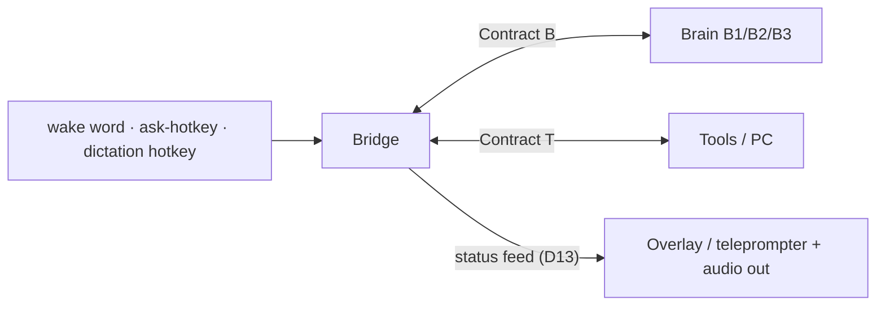

# Spec 00 — System overview & status

**Last reconciled: 2026-07-23** · Build progress: [STATE.md](../STATE.md) · Decisions record: [docs/02](../docs/02_architecture/02_system_architecture.md)

## The system in one paragraph

Gemma is a **UI-first desk assistant on Windows** (D23): the **bridge** (**G**), a Python
daemon on the hub machine (Windows PC or Mac — D10), driving one visible surface — the
**Teleprompter** (**P**), a Dynamic-Island overlay in its own process on the status feed
(D13/D19). Two doors (D20): a **dictate** hotkey puts speech at the caret, and an **ask**
hotkey opens the assistant — speech → STT → **Contract B** to a swappable brain (B1 Claude
API → B2 local LLM → B3 agent CLI) → an answer that renders on the Teleprompter, rewrites a
selection, or calls tools. Requested PC actions run through the **Contract T** tool registry
with tiered safety gates (M1). **Display always, speech by choice (D23):** the Teleprompter
always carries the answer, while **TTS** and the **wake word** are supported capabilities
behind user switches (default off, spec/70) — turn them on and Gemma speaks and answers
hands-free; leave them off and it is a screen-and-keyboard tool.

## Legend — naming scheme

One letter per element. The **bridge (G)** is the hub; **B/T/P** are the things it
connects to, each over the matching Contract.

| Letter | Element | Contract | Component IDs |
|--------|---------|----------|---------------|
| **G** | Bridge — the Gemma daemon (audio, wake, STT, TTS, orchestrator) | — (it *is* the hub) | build steps 0–7 |
| **B** | Brain — swappable LLM | Contract B | **B1** Claude · **B2** local · **B3** CLI |
| **T** | Tools — registry + executor + PC actions | Contract T | safety **Tier 1–3** |
| **P** | Teleprompter — on-screen overlay (separate process) | Contract P | status feed ([schemas/status.json](schemas/status.json)) |

Orthogonal axes: **milestones M0–M4** (project-wide stages — see below) and the frozen
**decision records docs 01–04**. Milestone *definitions* live in this file; the live
per-track *sub-steps* live in `STATE.md`; the frozen M0 build order is in docs/04 §8.

> **Terminology note (old → current).** The frozen docs/01–04 use earlier names and are
> not retro-edited (hard rule 2). Current truth: STATE.md tracks relettered **A→G**
> (Bridge), **C→B** (Brain), with a new **T** (Tools) track — so "Track A's queue" in
> docs/04 §8 is now Track G's.

## Component inventory

| Component | Spec | Code location | Lands at |
|-----------|------|---------------|----------|
| Hotkey triggers (ask-Gemma · dictation) | [40_interaction](40_interaction.md) + 60_dictation (owed) | `bridge/hotkeys.py` | ask pre-M0-run (D16) · dictation at D1 |
| Audio pipeline (wake, VAD, STT, TTS, earcons) | [40_interaction](40_interaction.md) | `bridge/audio/` | M0 |
| **Teleprompter** (P) — overlay, separate process on the status feed | [40_interaction](40_interaction.md) § Visual output | `teleprompter/` | v0 pre-M0-run (D13/D19) · dictation states at D2 |
| Orchestrator (state machine) | [40_interaction](40_interaction.md) | `bridge/orchestrator.py` | M0 (build step 6) |
| Brain adapters | [20_contract_b](20_contract_b.md) | `bridge/brains/` | B1 at M0 · B2 at M2 · B3 at M4 |
| Tool registry + executor | [30_contract_t](30_contract_t.md) + [schemas/tools.json](schemas/tools.json) | `bridge/tools/` | M1 |
| Security posture | [50_security](50_security.md) | cross-cutting | always (BINDING) |
| Dictation (hotkey → transform → paste) | 60_dictation (owed — drafted after the M0 run) | `bridge/dictation/` | MD |

## Milestones

Definitions only — live progress per track is in [STATE.md](../STATE.md).

| Milestone | Definition (acceptance test) |
|-----------|------------------------------|
| **M0 — Loop closed (UI-first, D23)** | Ask-hotkey → question: the response **streams to the Teleprompter**; perceptible feedback < 1.5 s (D11/D16), ×10 consecutively · B1 brain, zero tools. **With speech enabled** (not pass/fail for M0, measured when on): first spoken word < 4 s; **with "listen for me" enabled**: the wake word opens the same door. Supersedes D16(2)'s speech-gated shape — display is what M0 proves. |
| **M0.5 — It speaks well** | A 10-prompt bank (factual · complex · list-shaped · tool-result) each renders voice-correctly *without* the sentence-count heuristic: short answers spoken whole, long → spoken TL;DR + held detail, no markdown/emoji/URL reaches TTS, numbers/units read naturally. A model-driven output contract replaces spec/40's ≤2-sentence stopgap; adapter-agnostic (B2-tolerant parse). |
| **M1 — It acts** | "Open Spotify and play something" → `awake` earcon; audit log shows the calls; 6 starter tools |
| **M2 — It's local** | M1 script passes with Wi-Fi unplugged (B2 brain) |
| **MD — It types** *(feature milestone, parallel to the M-ladder)* | Hotkey → dictated speech lands in the focused app: ×10 consecutive dictations across ≥3 apps paste correctly after cleanup, zero answer-instead-of-transcript failures; capture in RAM; assistant loop unaffected |
| **M4 — Experiments** | B3 adapter · per-request routing |

*(No M3: it was the custom-headset milestone, removed when Contract H was excised — D18.)*

## Fixed platform decisions

Python 3.12+ / asyncio for the bridge (rationale: docs/02 §6). Audio: 16 kHz 16-bit mono
PCM in, 24 kHz mono out (constants in [schemas/audio.json](schemas/audio.json)). Wake
word: user-specified phrase → trained keyword model (openWakeWord) — never an LLM, never
continuous transcription. STT: faster-whisper (`small.en`), GPU where
available (CUDA on the RTX-5080 host; CPU on Mac until a Metal engine is added).

**D10 (2026-07-10): cross-platform hub.** The bridge targets **Windows 11 and macOS as
full peers** (Thomas runs a Windows/RTX-5080 desktop and a Mac laptop; an M4/M5-class
Air can also run B2 locally via Ollama/Metal). Platform-specific code is confined to
exactly two seams: audio endpoint access and the Contract T tool-executor backends
(spec/30 rule 3). Everything else — orchestrator, brains, transports, schemas — is
platform-neutral by construction. Windows is the reference platform (built and tested
first); macOS parity is checked at each milestone, not retrofitted at the end.
Portability design: docs/04 §3.

**D11 (2026-07-12): feedback-first latency posture.** The system guarantees fast
*feedback*, not fast *answers*. Every turn class produces something audible within
**1.5 s** of end-of-speech (the first spoken word, or the `working` earcon). A no-tool
conversational answer must then start speaking within **4 s** (B1) / **5 s** (B2) —
provisional numbers pending the owed measurements (STATE: step-3 live mic test, B1
first-token re-run). A tool-running turn is acknowledged within the same 1.5 s but has
**no completion bound** — it finishes when it finishes and signals with the
`task-complete`/`error` earcon. Consequences: TTS stays **generate-then-play** for
M0/M1 (sentence-streamed TTS parked; reopen only if measured use feels slow); spoken
tool-progress narration is config-gated, **default off** (`working` ping, then silence —
the PC overlay carries continuous state). Clock definition in spec/40. No "complex task
mode": long-running work is a property of the turn the orchestrator observes (ToolCall
events), never a spoken mode the user must remember to enter or exit.
*(Amended by D16: "audible feedback" is now "perceptible feedback" at the desk —
earcon, first spoken word, or overlay state change; audible alone must still satisfy
the guarantee away from the screen.)*
*(Amended by D25: the 4 s / 5 s first-word numbers are **demoted from pass/fail gates to
measured diagnostics** — under generate-then-play they are a reply-length proxy, and D23 made
the streaming text, not the first spoken word, the first feedback. The fast-**feedback**
guarantee stands and is now met by the screen. All numbers live in `spec/schemas/targets.json`.)*

**D12 (2026-07-18): dictation joins as an assistant-internal feature.**
The project re-centres on bridge + brain + tools: audio I/O runs on commodity gear
(IEMs + built-in/desk mic). **Dictation** becomes a first-class feature *within* the
assistant (the assistant remains primary): a global hotkey (hybrid — tap = toggle, hold
= push-to-talk) triggers capture → STT → LLM cleanup ("transform, never answer") →
clipboard-paste into the focused app. **Trigger-is-the-mode:** the wake word always
means assistant, the hotkey always means dictation — no spoken mode-switching, no intent
inference. The paste is
deterministic post-processing, never a Contract-T tool — the model cannot invoke it;
only the user's keypress does. Capture stays in RAM (spec/50 rule 3 unchanged). Full
behaviour spec: `spec/60_dictation.md` (owed — drafted after the M0 acceptance run,
sequencing decided 2026-07-18). Design study:
[Review — Gemma & VoiceInk codebases](../docs/01_scoping/Reviews/2026-07-18_1643_Review-gemma-voiceink-codebases.md).

**D13 (2026-07-18): overlay architecture — a separate process on a status feed.** The
PC overlay (spec/40 § Visual output) runs as its **own process**, never inside the
daemon: the orchestrator broadcasts JSON status events — state transitions,
partial/final transcript, mic level, per-turn latency — over a **localhost-only**
socket, and the overlay is a dumb subscriber rendering whatever arrives. Rationale:
crash isolation (overlay death never touches the voice loop) · no GIL contention
between repaints and audio/STT · renderer swappability. Its listening indicator inherits
spec/50's truthful-indicator rule. The feed's message schema lands in `spec/schemas/` at
build (hard rule 3).
Renderer: **PySide6/Qt** on Windows — frameless, translucent, and **non-activating
(BINDING, spec/40)**: the overlay must never take focus, because during dictation focus
determines where the paste lands. A later mac renderer consumes the same feed. Build
order: overlay v0 (state · live transcript · latency readout) lands **before the M0
acceptance run** as its instrument; dictation states at Track D's D2.

**D14 (2026-07-20): the assistant at the desk — teleprompter overlay, third trigger,
in-memory history.** With H parked (D12) the desk is the primary context, and the
overlay graduates from supplement to **first-class surface at the desk**: a
teleprompter rendering the transcribed prompt, the brain's response as it streams
(text deltas), and tool activity — expandable to the full current-session turns.
**Eyes-free is demoted, not deleted:** away from the screen, earcons and TTS alone
must still fully carry the experience (spec/40 amended). **Third trigger — the ask-Gemma hotkey** (push-to-ask): trigger-is-the-mode
survives because each trigger still means exactly one thing — wake word = assistant
hands-free · dictation hotkey = dictation · ask hotkey = assistant push-to-ask. At the
desk the ask hotkey will likely dominate the wake word (instant, zero false-accepts);
the wake word's constituency is away-from-desk — accepted
knowingly. **History: in-memory only** — the expandable view shows the current
session's turns from RAM; nothing is written to disk (spec/50 unchanged); revisit only
if real use demands recall across restarts. Rendering reality: the response side can
teleprompter-scroll from day one (brain deltas already stream); the prompt side
appears as a block at end-of-speech until streaming STT (deferred) exists.
*(Amended by D22: the **⌄ expandable-overlay mechanism is cut** — built, seen and rejected.
The island carries no controls; prior prompts move to the expanded view. In-memory-only and
response streaming stand.)*
*(Amended by D23: "eyes-free is demoted, not deleted" is demoted one step further — audio
away from the screen is a **capability behind a switch**, not an obligation. Speech and the
wake word ship off by default; the Teleprompter always carries the answer.)*

**D15 (2026-07-20): prompt hygiene — shared word-replacement; LLM cleanup as a gated
experiment.** A **deterministic word-replacement layer** (user-curated find-and-replace
table for known STT mishearings — names, jargon; word-boundary matching, longest match
first) runs on every transcript in **both** paths: before `transform` in dictation,
before the brain in the assistant loop. Microsecond cost, no model, fixes only what
it's taught; the table lives in `spec/schemas/` (hard rule 3, schema owed at build).
Separately, **`--clean-prompts`** (config flag, **default off**): the assistant path
may pass the transcript through `transform()` ("fix transcription errors and restore
structure only; change nothing else") before the brain — motivation: long composed
prompts arrive as rambles. Runs **per-prompt**, never per-sentence (self-corrections
span sentences; batch STT yields no early sentences anyway; the incremental-clean
option opens only if streaming STT lands). Engine: a small local model once the Ollama
groundwork (Track B) exists — not the cloud brain. Judged empirically: cleanup gets
its own row in the per-turn latency table, and an A/B on ~20 real transcripts (raw vs
cleaned → compare brain answers) decides default-on or delete. D11's bounds apply to
the flag-off path; flag-on latency is precisely what the experiment measures. The
overlay shows raw → cleaned whenever the flag is on (D14 teleprompter).
*(Amended 2026-07-18/D19 and 2026-07-23/S-06: the cleanup **engine is per-role and
configurable**, not one global choice. **Dictation** cleanup uses **Groq** (cloud, fast/cheap;
key in the tray → `("gemma","groq")`), revising this decision's "not the cloud brain" for that
path. The **assistant-path `--clean-prompts`** engine **stays local for now** — this decision's
latency/privacy argument holds there. Each role selects its own engine in settings (spec/70),
default local; the config plumbing waits on the config source, M0-close gate. Composes with the
parked multi-provider routing.)*

**D16 (2026-07-20): re-founding — the desk product.** Adversarial review of the
accumulated D12–D15 patches against the original eyes-free spec; every survivor below
survives by re-affirmation, not inertia. Rulings: **(1) Both, always.** At the desk
every answer streams to the overlay **and** is spoken (barge-in intact) — redundant by
design: glance or listen. Away from the screen, audio alone must still carry (D14).
Amends D11 as noted there.
*(Amended by D23: "both, always" becomes **display always, speech by choice**. The
Teleprompter always carries the answer; TTS and the wake word are capabilities behind
switches, default off, and neither gates the project. Ruling (2)'s M0 shape is restated
there too — the ×3 audio-alone variant is no longer a pass/fail criterion.)* **(2) Desk-shaped M0.** The acceptance test now matches the
product: ×10 ask-hotkey turns with overlay streaming + speech, plus a ×3 wake-word
variant proving the spoken path carries alone. Consequence: the ask-hotkey (and the
shared hotkey module) builds **before** the acceptance run — reversing D14's ordering;
Track D's D1 now reuses Track G's hotkey plumbing, not vice versa. **(3) Re-affirmed on
merit:** the capture stack (wake/VAD/whisper — both doors and dictation stand on it) ·
OutputPump's BT keep-alive (any Bluetooth audio) · spec/50 invariants · Contracts B/T ·
the wake word as the hands-free/away door, knowing the ask-hotkey will dominate at the
desk. Nothing else from the eyes-free era binds the desk product.

**D17 (2026-07-20): rewrite mode in principle; interaction-consolidation gate before
Track D.** Field use of VoiceInk (review: docs/01_scoping/Reviews, 2026-07-20)
surfaced a third interaction format Gemma lacked: **rewrite** — select text in any
app, invoke, speak an *instruction* ("make this firmer and halve it"), and the
selection is replaced by the transformed text. Adopted **in principle** as a Track D
slice (D3, after dictation works): selection capture via simulated Ctrl+C round-trip
(Windows) · spoken utterance = the instruction, selection = the content ·
`transform()` with a rewrite-ladder contract (selection → instruction+text →
bare text; see the review §3) · delivery = paste over the selection, user-initiated —
the D12 boundary holds, the model never chooses to paste. **Gate (binding on Track
D):** before any Track D build begins, a dedicated **interaction-consolidation
review** answers "how exactly does a user interact with Gemma?" The trigger inventory
has grown piecemeal — wake word · ask-hotkey · dictation hotkey · proposed rewrite
trigger; VoiceInk ships three unique shortcuts for its three functions, and
alternatives are open (one key + modifiers · press-patterns · selection-presence
switching a shared key · a radial/pill menu on the overlay). Terms of the review:
mode selection stays **deterministic** — no intent inference, the D12 invariant — but
the *mapping* of gestures to modes is open, including revisiting how many distinct
keys exist. Output: a consolidated trigger scheme recorded as its own D-number and
encoded in `spec/60_dictation.md` (which is drafted only after the review).

**D18 (2026-07-20): Contract H excised — the custom headset is cancelled, not parked.**
The "do I actually want to build this" test (D12's stock-hardware-first plan) came back
negative: AirPods and IEMs deliver excellent audio, so the custom bone-conduction
headset isn't worth building. **Contract H, the H0–H4 ladder, the transport adapters, the
M3 milestone, and all attendant language are removed from current truth** — the design is
preserved in git history + the frozen docs/01–04 if ever revived. Supersedes the headset
halves of D12 (parking → cancellation), D13 ("a second headset made of pixels"), and D16
((3) parked banner). Survivors the desk product inherited stay, reframed: the audio
format constants (16 k / 24 k) moved from the deleted `messages.schema.json` to
`spec/schemas/audio.json` (loaded by `wake.py` / `speak.py`); `earcons.json` (the bridge
plays them); spec/50's truthful-indicator rule (now the overlay's indicator, not an LED);
OutputPump's BT keep-alive (any Bluetooth audio); push-to-talk (now the hotkey).
`spec/10_contract_h.md` and `messages.schema.json` are deleted; audio stays commodity
(AirPods / IEMs / desk mic).

**D19 (2026-07-21): the Teleprompter formalised — component P, Contract P, front/back
split.** The on-screen overlay is named the **Teleprompter** and lettered **component P**
in the naming scheme (legend above); the localhost status feed it subscribes to is
**Contract P** (`spec/schemas/status.json`). Architecture (D13 restated as a contract):
the system splits front/back. The **back-end** is the headless `bridge/` daemon, which
owns a **crash-isolated broadcaster** (`bridge/broadcaster.py`) publishing Contract-P
messages as NDJSON over a localhost-only TCP socket (127.0.0.1, the docs/04 §5 reserved
port 8990). The **front-end** is a new top-level **`teleprompter/`** package (PySide6 +
QML) — a dumb subscriber that renders whatever arrives and never drives the voice loop.
*(Amended by D24, 2026-07-22: still a subscriber, and it still cannot drive the loop — but it
owns the display decisions the daemon could only guess at, and may send one upstream verb,
`dismiss`, which cancels and never commands. spec/50 rule 12.)*
**Crash-isolation is by construction:** the broadcaster's `publish()` never blocks and
never raises, and a busy port just disables the feed, so a slow, absent, or dead overlay
(or the broadcaster itself) can neither stall nor crash the orchestrator. The always-up
daemon is the server; the overlay is the reconnecting client. Contract P gains an
**`error`** message (`kind` + human-facing `message`) so the surface can explain a fault,
not merely flag it. Secrets stay provider-scoped in the OS credential store (spec/50 rule
10): the tray's cleanup-engine field writes the Groq key under `("gemma","groq")` —
per-role provider *routing* is a later concern (STATE Parked/someday), kept out of the key
name. Supersedes the `bridge/ui/` code-path (now `teleprompter/`) in the component
inventory and spec/40. Build sequence and progress: STATE Track P.

**D20 (2026-07-21): the two-door interaction model.** The D17 interaction-consolidation
review (held 2026-07-21) resolved to **two doors, not three modes**: **dictate** (dumb)
and **ask** (smart), one hotkey each (bindings live in config — spec/70), hybrid
tap-toggle / hold-PTT per key (D14). **Dictate:** capture → deterministic word-replace
(D15) → `transform` cleanup → paste at the caret — no intelligence beyond cleanup,
ever. Safety rule: invoking dictate while text is selected warns on the Teleprompter
before pasting over it. **Ask:** the full assistant — utterance + context (selection,
clipboard) go to the brain, which *is* the toolpicker: Contract B tool-calling over the
tools.json registry routes intent (answer · rewrite · fetch · act). Answers render on
the Teleprompter and speak (D16). *(Amended by D23/S-04: answers render **always**;
they are **spoken only with speech enabled** — default off. "and speak" reads as
unconditional above; D23 made it a switch.)* **Rewrite is not a mode — it is an ask outcome**
(supersedes D17's separate-slice framing; the selection is the content, the utterance
is the instruction). Write-actions from the ask door are **propose-then-tap** by
default: the proposal renders on the Teleprompter and a second tap of the ask key
applies it — only a user keypress ever pastes (D12). An **`auto_apply`** setting
(spec/70, present from the first config, **default off**) bypasses the tap knowingly.
The wake word remains the hands-free second entrance to the ask door — no new mode.
Resolves D17's gate: Track D is unblocked by this record (the M0 acceptance run
remains its other gate).

**D21 (2026-07-21): Rust port — evaluated and deferred.** An adversarial runtime
review (external critique + counter-analysis, 2026-07-20/21) examined moving the
engine to Rust. **Ruling: finish the app in Python first; port later, if ever —
triggered by observable facts, not rhetoric.** The port plan is preserved so a future
port inherits it ready-made: **back-end only, behind Contract P** — a Rust daemon
(Tokio · `cpal` capture · ONNX runtime for STT/VAD/wake · `reqwest` streaming brains ·
native hotkey/paste seams) publishing the same NDJSON feed on the same port, so the
QML Teleprompter keeps working unchanged and doubles as the port's live behaviour
oracle; same-repo Cargo workspace; the Python engine becomes the reference
implementation. **Re-open triggers (any one):** ① measured pain — boot-time/RSS
instrumentation (a planned Contract-P addition) shows real leak or latency problems in
daily use · ② Gemma becomes an always-on battery-powered laptop daemon · ③ shipping
to a second non-technical user (signed-installer era). **Anti-relitigation clause
(binding on every session, human or AI):** no runtime/architecture re-debate until the
Python app is feature-complete (Teleprompter C2/C3 · hotkeys · dictate door · ask
door) *and* the instrumentation has produced numbers. Recorded findings: the engine's
heavy work runs in native GIL-releasing libraries; leaks are logic bugs in any
language, bounded here by fixed buffers and discard-after-use; slow boot is model
loading (any runtime) — answered by tray-residency, not a rewrite.

**D22 (2026-07-21): the island carries no controls — the ⌄ handle is cut, everything it
promised moves to the expanded view.** D14 gave the overlay a **⌄ handle** that expanded to
the session's prior prompts. It was built, seen in place, and **rejected**: the tab hanging
below the pill spoiled the line of an otherwise sleek teleprompter. **The island is now a pure
display surface with no interactive elements at all.** Consequences: (1) prior prompts move
into an **expanded view**, which becomes the single home for everything the island deliberately
does not carry — prior prompts, the **full text of a long reply** (the island caps at 3 lines
and scrolls, so this is also how spec/40's "longer answers: full text on the overlay" is
honoured), and **copy / save / export**. Its design is explicitly NOT settled here and gets its
own pass; recorded now because the override itself is decided and the code already reflects it
(hard rule 1). Scope caution for that pass: copy is safe, save/export must reuse spec/50's
transcript-logging rather than invent a second path, and "send" is an integration belonging
behind Contract T (M1+), not a button the overlay owns. (2) Having no controls is what lets the
island be **wholly click-through** (`WS_EX_TRANSPARENT`) so it never intercepts a click meant
for the window beneath it — it sits over a maximised browser's tab strip. **Implementation
warning:** do NOT reach for `QWindow.setMask()` for this; Qt documents it as an input hint but
on Windows it is `SetWindowRgn`, which clips *painting* too (measured: island 70% painted
before, 10% after). Per-region click-through in a single window would need `WM_NCHITTEST` →
`HTTRANSPARENT`; unnecessary while the island has no controls, and the expanded view wants its
own window regardless. Supersedes D14's expandable-overlay mechanism; D14's other rulings
(in-memory only, response streaming, eyes-free demoted) stand.
*(Amended by D27, 2026-07-23: the expanded view is now built as a "peek". "No controls" holds **at
rest**, but the island takes hover+clicks over its silhouette while a reply is peekable — so
click-through is now **per-region** (`WM_NCHITTEST`), not the blanket `WS_EX_TRANSPARENT` this
decision relied on. In-memory-only stands.)*

**D23 (2026-07-21): identity — a UI-first desk assistant; display always, speech by choice.**
States plainly what the build has become, and settles the drift between a spec that made
speech mandatory and a working intent that treats it as a feature.

**Identity.** Gemma is a **UI-first desk assistant on Windows**: an STT + AI pipeline whose
surface is the **Teleprompter**, reached through two doors — **dictate** (speech to text at the
caret) and **ask** (the assistant, which also rewrites and calls tools). Closest kin are
VoiceInk and Siri, but the shape is its own: dictation and assistance over one capture stack,
one brain contract, one visible surface. This is a statement of what exists, not a change of
direction — **D12 stands unchanged**: dictation remains a first-class feature within the
assistant, and the assistant remains primary.

**The Teleprompter is the spine.** Every answer renders on it, always. It is not optional, not
configurable, and not a supplement: D20's propose-then-tap cannot function without it (an
ask-door rewrite has nowhere to show its proposal), and dictation's feedback depends on it.
Accordingly PySide6 stops being an optional `[ui]` extra and becomes a core dependency.

**Speech and the wake word are demoted, not retired** — this is the substantive amendment to
D16(1)'s "both, always". Both remain fully built and supported; both move behind user
switches, **default off**; and **neither gates the project's success**. Out of the box Gemma is
hotkey-driven and screen-only. Turn on **speech** and answers are spoken as well as shown; turn
on **"listen for me"** and the always-on-mic behaviours — wake word and barge-in — come alive
together (they are one privacy decision, not two: both open the mic without a keypress, so they
share one switch, and the truthful-indicator rule of spec/50 rule 4 governs both). Settings
live in spec/70.

**The away-from-screen guarantee is demoted from BINDING to a supported capability.** spec/40's
"earcons and TTS alone must still fully carry the experience" was the last load-bearing residue
of the cancelled eyes-free/headset era (D18). Walking away and talking to Gemma still works —
that is what speech-on and the wake word are *for* — but it is no longer an obligation the
whole system is held to, and no longer something the acceptance test proves. This retires the
residue without retiring the capability.

**Consequences.** (a) M0's acceptance test becomes display-first: ×10 ask-hotkey turns with the
answer streaming to the Teleprompter, feedback < 1.5 s; the spoken path is exercised only with
speech enabled, and the ×3 "spoken path carrying alone" variant is no longer pass/fail.
(b) spec/40's narration rules and § Visual output are reworded accordingly. (c) The parked
"listen for me" decision is **settled here** rather than left owed. (d) D11's feedback budget is
unaffected — "perceptible feedback" already counts an overlay state change, so a screen-only
Gemma still meets it.

**D24 (2026-07-22): the Teleprompter owns what is on screen — Contract P gains one upstream
verb.** Three display bugs in three days had one root: **the daemon was deciding things only
the overlay could see.** It timed how long an answer stayed up (a guess at the island's own
typing speed — first a flat 8 s, then 8 s + 0.45 s/word, and it blanked long answers mid-reveal
both times); it decided when the prompt gave way to the reply (which truncated any prompt past
~11 words, every warm turn); and it armed the bare Esc key against its own idea of what was
displayed (holding Esc hostage from every other application for up to 90 s per turn, while the
loop that was actually running never once looked at it). None of these are facts the daemon
possesses. All three are facts about a reveal happening in another process.

**Ruling.** The overlay owns the display: when the prompt hands over, when the island stops
showing, and the Esc key that dismisses it. The daemon owns the voice loop and says only what
it knows.

- **`idle` is demoted to "the daemon is free".** It no longer blanks the island and no longer
  clears the turn. The overlay hides itself a fixed interval after the text has **finished
  revealing** — the clock finally starts from the right event, so the knob is a legible
  "N seconds after it finishes appearing" instead of a per-word estimate of someone else's
  animation.
- **The turn-clear moves onto `listening`.** Opening a capture window *is* the clear, so the
  binding "never draw the mic bars over a stale answer" stops depending on a caller remembering
  to blank first — which is exactly how the barge-in entrance came to violate it. Sound only
  because every capture window is now user-initiated (the follow-up window is gone); if a
  non-turn capture ever returns, this must change back **before** it lands.
- **Contract P stops being strictly one-way.** The overlay may send exactly one message,
  `dismiss`, and the daemon accepts nothing else (allowlisted from `status.json`). This
  **amends D19's "never drives the voice loop" and spec/70 §2's "no control channel back"** —
  both written before dismissal existed as a gesture. The replacement guarantee is narrower and
  stated as **spec/50 rule 12: the upstream channel can cancel, never command.** It can only
  stop work already in flight; it can never start a turn, invoke a tool, or change a setting.
  The exposure it adds is minor next to what the same socket already grants a local process —
  which is to *read* every prompt and reply.
- **Esc moves to the overlay**, which registers it only while the island is on screen. That is
  exact rather than inferred: the overlay *is* the window. A press hides the island immediately
  and tells the daemon afterwards, so dismissal never waits on a busy or dead daemon.
  spec/50 rule 11 (narrow registration, no keyboard hook) governs it unchanged. Ask and dictate
  keep their modifiers and stay with the daemon.
- **Deletions this buys:** the daemon's dwell constants and `answer_dwell()`, its `self.shown`
  guess at the island's contents, and the whole transient-door arming protocol in
  `bridge/hotkeys.py` (with its cross-thread race on `_armed` and its duplicated hotkey-id
  derivation). `parse_binding` loses its modifier-less exemption entirely.
- **Cost, eyes open:** with the Teleprompter not running there is no dismiss gesture at all
  (the ask key still interrupts) — coherent with D23's "the Teleprompter is the spine". The
  overlay needs a Win32 native event filter; macOS is unbuilt there, the same seam
  `bridge/hotkeys.py` already has. `status.json` → **v0.3.0** (`dismiss` message; the clearing
  rule and the upstream allowlist promoted from prose to loaded data, hard rule 3).

Source: the adversarial review of 2026-07-22 (G-01, G-02, P-01's class, and STATE's own
refactor brief — *"a fact living on two sides of a seam, and one side not being told"*).

**D25 (2026-07-22): latency targets re-derived for the desk, and made a single source.** The
acceptance criteria are **D11 (2026-07-12) — written for the eyes-free headset era**, and never
re-derived after D18 cancelled the headset or D23 made the screen the spine. Audited 2026-07-22.
Two things were wrong and one was messy:

- **`first_word` (< 4 s B1 / < 5 s B2) was a latency gate that is really a reply-length cap.**
  Under generate-then-play (D11) the first spoken word waits for the *whole* reply to be
  generated and synthesised, so its latency scales with reply length — the acceptance run fits
  ≈ 2100 ms + ~45 ms/output token, i.e. the 4 s "gate" is a ceiling of ~42 tokens dressed as a
  stopwatch. And since D23 the streaming text on the island, not the first spoken word, is the
  first feedback. **Demoted to `measured`:** recorded per turn as a diagnostic, never pass/fail.
  M0's acceptance test already treated it this way ("measured when speech on, not pass/fail");
  this makes the spec and the overlay agree. A first-word *target* becomes meaningful again only
  with sentence-streamed TTS (parked, D11) — reopen that with the measured number, not on feel.
- **The `feedback` gate measured the headset, not the desk.** The instrument credited only
  *audible* events, so it reported our own 1.4 s `working`-earcon timer every turn and gave the
  screen zero credit — even though D16 says an overlay state change is perceptible feedback. The
  instrument now credits the near-instant flip to THINKING; the earcon is the speech-mode
  fallback. The fast-feedback guarantee stands and is now honestly met by the screen.
- **The numbers lived in four places** (spec/40 prose · `Overlay.qml` · the orchestrator's
  latency table · scattered comments) and had already drifted once (frozen docs/02 still carry
  the pre-D11 values). Consolidated into **`spec/schemas/targets.json`** (executable truth, hard
  rule 3), each target carrying its value, its `kind` (`floor` / `gate` / `measured`), and its
  clock. The overlay's readout and the latency table load it; the reclassification is now *data*
  the renderer obeys, so first_word cannot be coloured over-budget by a stray literal.

Kept unchanged and still sound: the 300 ms acknowledgement floors (wake, key-press), the 250 ms
barge-in stop, and the 1.5 s feedback *principle*. Source: the gates audit of 2026-07-22
(follows the B-01 finding, which is what surfaced the reply-length relationship in the log).

**D26 (2026-07-23): Tier-3 confirmation is a keypress, spoken alt when speech on.** The Tier-3
gate — the binding confirmation before a destructive tool runs — was written 2026-07-12 as
"play the `ask` earcon, user says 'confirm' within 8 s." That predates D20 and D23: the default
product now opens the mic only on a keypress and ships with speech off, so **there is no channel
on which to say "confirm"** — the safety gate on the most dangerous actions was unexecutable in
the default configuration. D20 had already invented the desk-native equivalent (propose-then-tap:
a proposal renders on the Teleprompter, a keypress applies it), so Tier 3 adopts it:

- **The proposed action renders on the Teleprompter; a keypress confirms it.** This is the same
  gesture D20 defined for ask-door rewrites — one confirmation mechanism, not two.
- **Spoken "confirm" within 8 s remains the equivalent gate when speech is on**, with the `ask`
  earcon (which now sounds only in that mode).
- Nothing was decided wrongly in 2026-07-12; Tier 3 simply was never revisited when the
  interaction model changed underneath it. Updates spec/30 (tier table), CLAUDE.md hard rule 4,
  `earcons.json` (`ask`), spec/40 narration. **No code** — Tier-3 tools are M1, unbuilt; this
  records the executable gate so it is right when the executor lands. Source: review S-02.

**D27 (2026-07-23): the expanded view — the island grows in place to "peek" the current turn, and
now takes input over its own silhouette (amends D22).** D22 cut the ⌄ handle, made the island a
controlless wholly-click-through surface, and parked the expanded view for its own pass. This is
that pass. **Hover a shown answer** and the island hints (a few px of downward nudge + a pointer
cursor); **click** and it grows *in place* — same black surface, same top-edge flares — into a
larger panel that reads the **current turn** in full: the prompt pinned and **collapsible past two
lines** (a genuinely long composed prompt is a Claude job, not this surface), the reply scrolling
under an always-on top/bottom fade, and **Copy** (clipboard) + **Save** (a save dialog). Height is
content-clamped between a floor and a ceiling; past the ceiling the reply scrolls with the prompt
and actions pinned. Esc collapses the peek before it dismisses the island; the answer-dwell pauses
while peeking.

- **Amends D22's "no controls / wholly click-through".** For the island to take a hover and a
  click it can no longer be blanket `WS_EX_TRANSPARENT` — which also stops it receiving
  `WM_NCHITTEST` at all. Click-through becomes **per-region** (`WM_NCHITTEST → HTTRANSPARENT`, the
  filter proven in `sandbox/qml_spike`): the painted silhouette takes input **only while there is a
  settled answer to peek**; the surrounding frame — and the whole island whenever nothing is
  peekable — stays click-through, so a click over empty frame still reaches the app beneath. The
  cost D22 avoided is now bounded to *while an answer is showing*, never at rest (idle hides the
  window entirely).
- **In-memory, current-turn only (D22/D14 stand).** Peek reads the turn already on the feed;
  nothing is written and no new Contract P message exists (`status.json` unchanged). Cross-session
  scroll-back and the full session view remain a later, separate surface tied to the
  conversation/memory model.
- **Save is user-initiated export** (spec/50 rule 3): every transcript is already logged to
  `logs/gemma.log`, so saving an on-screen answer to a file the user picks is strictly less
  exposure than the existing log. The host (`__main__.py`), not QML, owns the clipboard and dialog.
- Widens D14's expandable-session-view scope. Renderer: `teleprompter/PeekPanel.qml` +
  `Overlay.qml`; native input + actions in `teleprompter/__main__.py`. Guarded in `overlay_check`.
  Blueprint: `sandbox/teleprompter-expanded-mockup.html`.

