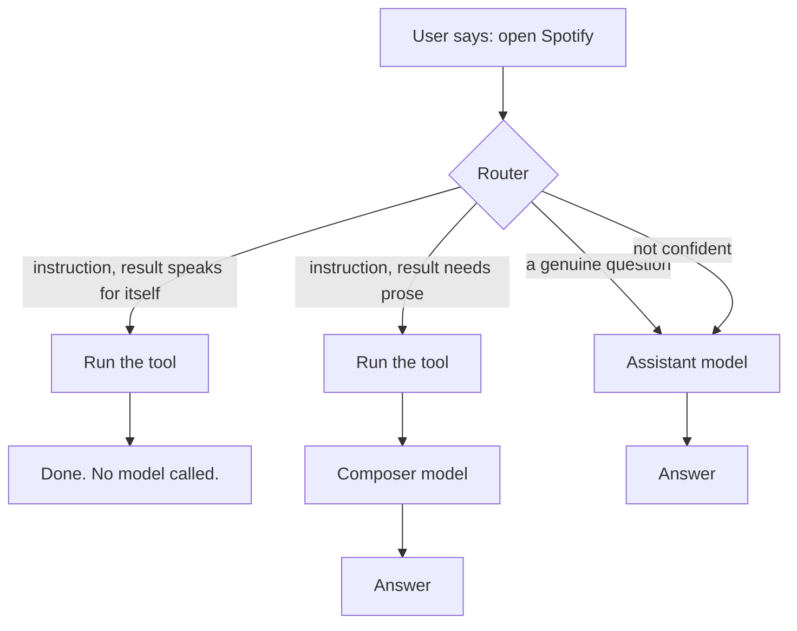
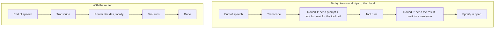
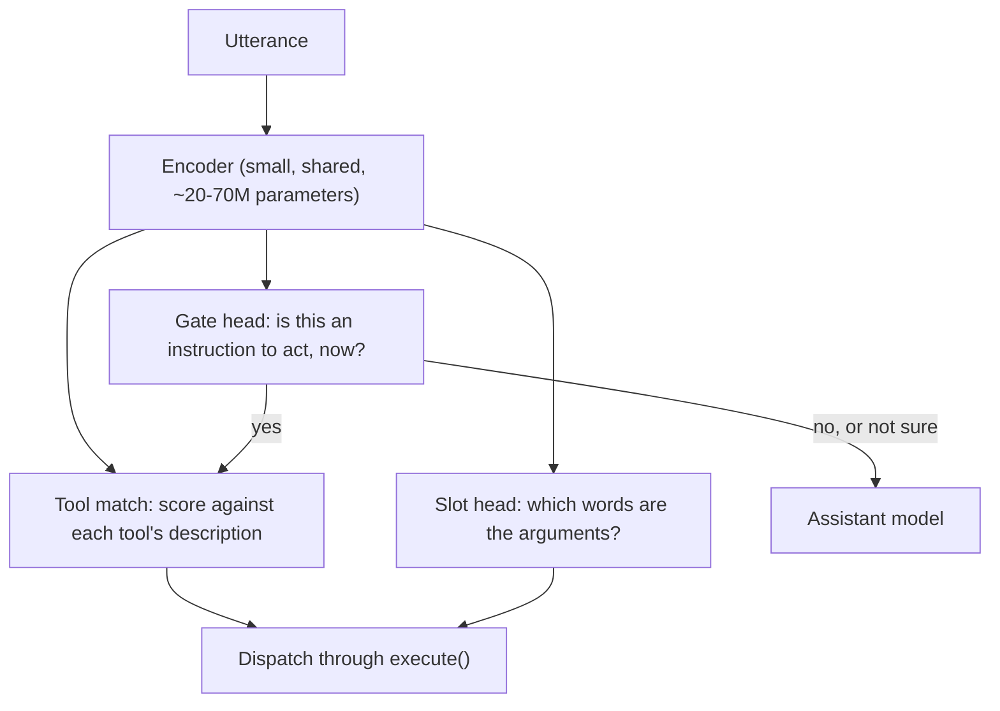
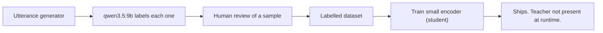

# Router master plan

**Last reconciled: 2026-08-07 03:35** 
- For build progress, *see* [STATE.md](STATE.md)
- For task roadmap and queue of remaining tasks, *see* [ROADMAP.md](ROADMAP.md)
- For binding behaviour, *see* [spec/docs/20_models.md](../docs/20_models.md), specifically "What the router must achieve"
- For harnesses, *see* [eval/](../../eval)

## Note to all readers, human and machine
This document is written to be human- and machine-readable. It records a unified plan for the "router" element of the `gemma` app, and all evaluation runs of the router (apart from training runs, which are not recorded; evaluation runs are runs which are run on an evaluation set devised by the user).

**Recording rule.** Every evaluation run against any router component is recorded here, in the *Evaluation log* at the foot of this document, at the time it is run. An entry records:

- the date and time of the run;
- the exact command, including the program, the flags and the arguments;
- the model or component under test, named by its full identifier;
- the number of cases, and the number of runs per case;
- the machine state relevant to the result (what else held VRAM, whether the model was wholly resident);
- the result, with commands and negatives reported as separate numbers;
- anything that went wrong during the run that could have affected the numbers.

If a run is not recorded in the *Evaluation log*, it must not be relied on. Hence, any number quoted in conversation, commit message, or in `STATE.md` without a matching entry in the *Evaluation log* is unsupported.

**Binding 100-run floor for evaluation-runs.** No test of any component is valid at fewer than **100 runs per case**. This is a floor, not a target. A result below the floor is recorded as `PROVISIONAL` and may not be used to justify a build decision, a model choice, or a claim of accuracy.

**Deterministic runs.** However, if a process is designed to be deterministic, then the corresponding *Evaluation log* the entry should record `runs=1 (deterministic)` and stipulate why.
- This exception applies only to strictly deterministic process. It does *not* apply to any stochastic process, including an LLM-run at `temperature = 0`.

**Language rule.** This document explains itself in plain words. Any technical term must be defined at its first use, in the *Concepts* section.

---

## Description of "router"

**Description:** Within `gemma` and this document, a `router` is defined as a small program that first parses the user's text input (as converted from speech via the STT engine), and routes the input into one of several paths. 

Today that decision is made by the assistant model, which is expensive, remote and slow for the cases where the answer was obvious.

Take the sentence "open Spotify". Today Gemma sends the whole sentence, the system prompt and the full tool list to the assistant model. The model replies with a tool call. Gemma runs the tool. Gemma then sends the result back to the model in a second request, and the model replies "Spotify is open." That is two network round trips and roughly 3,200 input tokens to act on a five-token instruction, of which the second round spends 1,630 input tokens to produce nine output tokens.

The router removes both round trips for that class of sentence. It reads "open Spotify", recognises it as an instruction to act, identifies the tool and the argument, runs the tool, and stops. The assistant model is never called.

The fourth path is the important one. When the router is not confident, it sends the sentence to the assistant model and the turn proceeds exactly as it does today. Nothing is lost, and the user cannot tell the difference.

**The three destinations, in the terms the code uses.** A tool whose result is self-explanatory ends the turn on its own. A tool whose result is raw data — a list of files, a list of emails — needs a model to turn it into a sentence, so the router runs the tool and hands the result to a **composer**. Everything else goes to the assistant model.

## What this saves

Two savings, and they are not the same size. The figures below are arithmetic on recorded token counts and published prices, marked throughout for which inputs were measured on this machine and which were not. Nothing here is a test result and nothing here belongs in the evaluation log.

### Latency

**The tool cannot run until round one comes back.** That is the whole latency argument. Gemma cannot open Spotify while it is waiting to be told to open Spotify, so the entire first cloud round trip sits between the user finishing their sentence and anything happening.

**There is a hard number this has to fit inside.** `shared/schemas/targets.json` sets `tool_ack` at 1,500 ms, measured from end of speech to a tier-2 action executing, and its kind is `gate` — a pass-or-fail guarantee rather than a diagnostic. Transcription is measured at about 35 ms warm on the graphics card, which leaves roughly 1,465 ms for the entire first round trip: network out, queueing, generation of the tool call, network back.

| Path | Time from end of speech to the tool running | Status |
|------|--------------------------------------------|--------|
| Cloud, two rounds | one full cloud round trip, unmeasured on this machine | the only adjacent figure recorded is 1,817 ms, and it is flagged as cold and as really measuring time-to-full-response |
| Local model as router | 35 ms transcription plus a 0.68 s median round | measured, `qwen3.5:9b` with reasoning off |
| Trained encoder as router | unmeasured | a target for Phase 3, and the number that decides whether the design is worth shipping |

The gate has never been tested on a cloud tool turn. The one number in the same neighbourhood exceeds it.

**Variance is the larger half of the argument.** `spec/docs/60_evals.md` already states the principle for the local path: a predictable delay can be designed around, an unpredictable one cannot. A cloud round trip adds network variance that cannot be measured from here and cannot be fixed from here, and two round trips draw from that distribution twice. The slow tail of a two-round turn is worse than the slow tail of either round.

**What the router does not fix.** A genuine question still costs a full cloud turn. The router removes latency only for what it catches, and the size of that saving is bounded by how many real utterances are commands — unmeasured, with user's estimate from use at 40 to 50%.

### Cost

The recorded figure for "open Spotify" is about 3,200 input tokens across the two rounds, of which round two spends 1,630 to produce 9 output tokens. Total output across both rounds is roughly 40 tokens, so input dominates the bill by about eighty to one.

Published prices per million tokens, read 2026-08-07: Opus 5 at $5 in and $25 out; Sonnet 5 at $3 and $15, currently $2 and $10 on introductory pricing through 2026-08-31; Haiku 4.5 at $1 and $5.

| Model | Cost per "open Spotify" | At 20 commands a day | At 50 commands a day |
|-------|------------------------|----------------------|----------------------|
| Opus 5 | 1.7 cents | $124 a year | $310 a year |
| Sonnet 5 | 1.0 cents | $75 a year | $187 a year |
| Haiku 4.5 | 0.34 cents | $25 a year | $62 a year |

The router removes all of it for the commands it catches, and none of it for anything else.

### Which argument carries the build

Cost does not. Tens to a few hundred dollars a year is a real number and not a decisive one, and it shrinks further on a cheaper model.

Latency does, on two grounds. The first is the gate: `tool_ack` is a pass-or-fail guarantee at 1,500 ms and the cloud path has never been shown to meet it. The second is variance, which is the property a voice assistant lives or dies on, and which a local decision controls and a cloud round trip does not.

The token figures are worth keeping anyway. Spending 1,630 input tokens to produce nine output tokens saying "Spotify is open" is the clearest statement of what round two is for on a command, which is nothing.

## The constraints

Three constraints shape every decision below. Each one rules out otherwise reasonable designs.

**Memory.** The router must not occupy a model slot. Gemma runs local models for the assistant role and the dictation cleanup role, and the graphics card holds a limited number of them at once. A router that is itself a general-purpose language model of 4 billion parameters or more takes 3 to 6 GB and forces the user to give up one of the roles they actually chose. The budget for the router is **a few hundred megabytes, resident at all times**, loaded directly by Gemma the way `faster-whisper` and `openWakeWord` are loaded, rather than through Ollama as a swappable model.

**Precision over recall.** The router must not act unless it is confident. Firing a tool on "I was going to open Spotify but I ran out of time" acts against what the speaker meant, which is worse than being slow. Every uncertain case falls through to the assistant model, and the fall-through must behave exactly as today.

**Tools must remain addable.** Adding a ninth tool to `shared/schemas/tools.json` must not require retraining anything. A design whose output is a fixed list of the tools that existed on the day it was trained is disqualified, however well it scores.

## What Siri and Alexa actually do

The reference point for this work is the generation of voice assistants that recognised "open Spotify" and "search my email for the invoice" reliably, on device, without a large language model anywhere in the loop. Their approach is a well-documented standard architecture with two parts.

**Intent classification.** The sentence goes in; one label comes out, drawn from a fixed set — `open_app`, `search_email`, and so on. The set includes a label meaning *none of these*, which is where ordinary conversation lands.

**Slot filling.** The same sentence is tagged word by word to find the arguments. In "open Spotify", the word `Spotify` is tagged as the application name. In "search my email for the lease", the words `the lease` are tagged as the search query.

Both run on one small trained model. This is the shape Gemma's router should take, because it is known to work at the accuracy Gemma needs, in the memory Gemma has.

## Concepts, explained plainly

Terms used in the rest of this document.

**Model, weights, parameters.** A model is a large collection of numbers, together with a fixed procedure for combining input with those numbers to produce an output. The numbers are the **weights**, also called **parameters**. Model size is the count of them. A 22-million-parameter model holds 22 million numbers; a 9-billion-parameter model holds 9 billion. Size on disk follows directly from the count.

**Training.** Adjusting those numbers so that the model's outputs match answers already known to be correct. Nothing else happens during training. The procedure is fixed; only the numbers change.

**Curve fitting.** The plain version of training. Given a scatter of dots on a graph, find the line that passes as close as possible to all of them. Once you have the line, you can read off a value for a position where there was no dot. Training a model is the same operation, with millions of adjustable numbers instead of a line's two, and with an input that is a sentence instead of a position on an axis.

**Regression.** Curve fitting where the answer is a number, such as predicting a house price.

**Classification.** Curve fitting where the answer is a category, such as deciding whether a sentence is an instruction or not. The router's central decision is a classification with two categories.

**Loss.** A single number measuring how wrong the model currently is across the training examples. Training is the process of making the loss smaller.

**Gradient descent.** How the loss is made smaller. Work out, for each weight, whether nudging it up or down would reduce the loss; nudge every weight a small step in the direction that helps; repeat. There is no cleverness beyond this.

**Embedding.** A sentence converted into a fixed-length list of numbers, arranged so that sentences with similar meaning produce similar lists. It places every sentence at a position in a space, where distance is supposed to mean similarity.

**Encoder.** The part of a model that reads text and produces those numbers.

**Head.** A small extra layer attached to the encoder's output that produces the actual answer. One encoder can carry several heads doing different jobs from the same reading of the sentence, which is what makes the design below cheap.

**Fine-tuning.** Taking a model someone else has already trained on a large amount of general text, and continuing to train it on a small amount of your own data. Far cheaper than starting from nothing, because the general knowledge is already in the weights.

**Contrastive training.** Training by example pairs rather than labels — telling the model that these two sentences belong together and these two do not. This is what moves the embedding space itself, and it is the technique that could separate two sentences that a general-purpose embedder places close together.

**Distillation, teacher and student.** Using a large, capable model to produce correct answers, then training a small model to reproduce those answers. The large model runs once, when the training data is made. It is not present when the system runs.

**Precision and recall.** Precision asks: of the times it fired, how often was it right. Recall asks: of the times it should have fired, how often did it. The two trade against each other, and the router is tuned for precision.

**Calibration.** Whether a model's stated confidence matches reality. A well-calibrated model that says it is 90% sure is right about 90% of the time. This matters because the fall-through rule depends on the router knowing when it does not know.

**Held-out test.** Keeping some data back, and never training on it, so that measuring against it says something about sentences the model has not seen. Holding back entire *tools* is a stronger version, and it is how the generalisation claim gets tested.

**Quantisation.** Storing the weights at lower numeric precision to shrink the file, typically about four times smaller for a small accuracy cost.

**ONNX and ONNX Runtime.** A portable file format for a trained model, and a program that runs it without needing the framework it was trained in. Gemma already uses this path for the wake word.

## The architecture

One small encoder reads the sentence once. Three heads read that encoder's output and answer three different questions.

**The gate head** decides whether the sentence is an instruction to act, right now, addressed to Gemma. It is a two-way classification. It never sees a tool, and it does not know how many tools exist, so adding a tool cannot affect it. This head carries the precision constraint, and it is the hardest part of the problem.

**The slot head** tags which words are arguments. It learns the shape of an instruction rather than the identity of any tool, so it also transfers to tools it has not seen.

**Tool matching** scores the sentence against each tool's written description, taken from `shared/schemas/tools.json`. This is the part that keeps the design open: a new tool is a new description to score against, requiring no retraining. A design that instead produced a fixed list of tool names in its output layer would be frozen at the tool set it was trained on, which is the failure this avoids.

**Dispatch is not execution.** The router decides and hands off. Every call goes through `execute()` exactly as a model-issued call does, so the tier check, the connector check and the audit log all apply unchanged. Routing around those gates would let a switched-off connector act.

## The risk, named

A general-purpose embedder places "open Spotify" and "I received an email from Spotify about my subscription" very close together, because they are about the same topic. They ask for opposite things, and the second names the subject of two different tools while requesting neither. This is the failure the whole design has to survive.

It is not a hypothetical. It was measured on 2026-08-04. Five general-purpose embedders were tested by nearest-example matching, and the best scored 57.1% on negatives — sentences that must not fire. The larger embedders were worse than the smallest, because a stronger topical model places the two sentences closer together and is more confidently wrong.

**What that measurement does and does not rule out.** It tested frozen, general-purpose embedders used with no training at all, matched by distance to hand-written examples. It rules that technique out. It does not rule out a trained classifier, because training changes the space itself rather than searching a fixed one. The distinction matters and has been conflated before: the failed technique measured topic, and the required judgement is grammatical and pragmatic — imperative against declarative, addressed to Gemma against describing the world.

**How the risk gets resolved:** by measurement, at the floor, on the held-out split described below. If a trained gate cannot separate these sentences, the design fails and the fallback is the assistant model deciding, as it does today.

## Training methodology

### Where the data comes from

`qwen3.5:9b` scored well on this judgement under a routing prompt. It is too large to be the router. It is the right size to be the **teacher**.

The teacher runs once, when the dataset is built. It is absent when Gemma runs.

**Generating the utterances.** Three sources, because a dataset drawn from one source teaches its quirks. First, real transcripts from `gemma.log`, which are the only true sample of how the user actually speaks. Second, generated variations across phrasings, verbs and tool subjects. Third, adversarial negatives written deliberately: every sentence that names a tool's subject without requesting it. The existing negatives in `eval/tool_check.py` are the seed set and are the hardest cases in the suite.

**Labelling.** The teacher assigns each utterance a gate label, a tool where one applies, and the argument spans. A sample is reviewed by hand, because a teacher's systematic mistake becomes the student's systematic mistake and nothing downstream will catch it.

**Class balance.** Real speech to a voice assistant is mostly instructions, and a dataset that reflects that will produce a gate that fires readily and scores well on an unbalanced test. Negatives are deliberately over-represented in training relative to their natural rate.

### The splits

Three ways of holding data back, each answering a different question.

| Split | Held back | Answers |
|-------|-----------|---------|
| Ordinary test | Random sentences, never trained on | Does it work on new sentences? |
| Held-out phrasing | Whole phrasing patterns and verbs | Does it work on ways of asking it never saw? |
| **Held-out tool** | Every example of one or more entire tools | Does it work on a tool added after training? |

The held-out-tool split is the one that decides whether the design meets the third constraint. Train with `search_email` entirely absent, then measure on `search_email` sentences. The gate should be unaffected, because it never sees tools. The tool matcher should still find `search_email` from its written description. A large drop there means the design has memorised tools and the claim of extensibility is false.

### What gets trained, in order

1. **The gate head alone.** It carries the precision constraint and it is the part that can fail outright. Train it first, measure it at the floor, and stop if it does not clear the bar. Everything after this is wasted work if the gate does not hold.
2. **The tool matcher.** Contrastive fine-tuning on pairs of an utterance and its correct tool description. Measured on held-out tools, not only held-out sentences.
3. **The slot head.** Token tagging for the arguments. Measured by exact match on the extracted argument, since a wrong argument opens the wrong application.
4. **Calibration.** Fit the confidence threshold on data held back from all of the above. The threshold is what makes precision adjustable after training.

### Setting the threshold

The gate produces a confidence figure. Somewhere between 0 and 1 there is a cut-off above which it fires and below which it falls through to the model. That cut-off is a dial for the precision constraint, and it is set from measurement rather than chosen.

The cut-off is chosen as the lowest value at which the false-fire rate on the negative set stays at or below the agreed budget. That budget is an open question recorded below. Whatever it is, it is a decision about how often Gemma may act against the speaker, and it is the user's to make.

**A warning drawn from the frozen-embedder run.** In that test, the margin between the best and second-best match was logged for every wrong answer: +0.003 to +0.15, the same band as the correct answers. No threshold anywhere in that range separated right from wrong. A trained classifier's confidence is a different quantity and may behave better, and that is a claim to be tested rather than assumed.

## Evaluation protocol

**What counts as a test.** A run of a named program, with recorded flags, against a recorded case set, at a recorded number of runs per case, on a machine in a recorded state, with the result written into the log below.

**The floor is 100 runs per case.** Stated in full at the head of this document.

**Commands and negatives are always reported apart, never pooled.** A single combined accuracy figure hides the failure that matters. A component that never fires scores perfectly on negatives and is useless. A component that always fires scores perfectly on commands and is dangerous. The 2026-08-04 sweep found the two best models at commands were the two worst at negatives, which a pooled score would have hidden completely.

**Runs and cases are separate axes.** Runs measure how consistent a component is on the same sentence. Cases measure how much of the language it covers. The 100-run floor governs the first. The second is governed by the case set, which stands at 17 sentences and is far too small — growing it is Phase 2 work.

**A model under test is proven wholly resident before its block runs.** A model partly spilled to system memory under pressure scores differently from the same model fully in VRAM. This was observed: one model scored 7 in 9 in a combined run and 8 in 9 in three isolated runs. Every other model is evicted and the runner is asked what it holds before a block begins, and the run aborts rather than measures if anything is resident or if the model under test is not wholly in VRAM.

**Every non-command answer is sampled verbatim in the report.** "It answered" and "it answered correctly" look identical in a table of numbers. A model inventing a plausible time of day instead of reading the clock is only visible if the text is kept.

## Build order

Each phase is a working state and a legitimate place to stop.

**Phase 0 — clear the ground.**
Fix the fault at `backend/orchestrator.py:346`, where a character outside the console codepage raises `UnicodeEncodeError` while printing a development trace and ends the turn as a generic fault. It corrupted the 2026-08-04 figures for one model and it can kill a real user's turn. Then re-run the three existing sweeps at the 100-run floor and record them properly, so the baseline is real.

**Phase 1 — the dispatcher, with no decider.**
Build the plumbing described in `spec/docs/20_models.md`: the registry fields declaring how far each tool can be reached without a model and whether its result needs a composer, the offline guard on those fields, and the dispatch path through `execute()`. Wire it behind a flag, default off, with a decider that always falls through. Prove that with the flag on and the decider abstaining, behaviour is identical to today. This phase is independent of what eventually makes the decision.

**Phase 2 — the dataset and the case set.**
Grow the evaluation case set well beyond 17 sentences, and build the training dataset by the method above. Both are the same activity done at different scales. Establish the three splits. This phase produces no running code and is the phase everything after depends on.

**Phase 3 — the gate.**
Train the two-way gate head. Measure at the floor, on all three splits, commands and negatives apart. This is the decision point for the whole plan. A gate that cannot clear the precision bar ends the design, and the honest outcome is to keep the assistant model making the call.

**Phase 4 — tool matching and slots.**
The remaining two heads, measured on held-out tools.

**Phase 5 — wire it in.**
The trained router behind the Phase 1 flag. Measure end to end: latency, false-fire rate in real use, and the fall-through rate. Default off until the numbers justify turning it on.

**Phase 6 — remove the second round trip.**
Skip the reply round for a tool whose result speaks for itself, under the conditions already recorded in ROADMAP 1.5: exactly one tool call in the round, the tool flagged self-describing in the registry, and its sentence written into history.

## Evaluation log

Every run against a router component, newest first. `PROVISIONAL` marks a result below the 100-run floor, which may not be used to justify a decision.

### 2026-08-04 — generative models, assistant persona · PROVISIONAL

- **Command:** `python -m eval.tool_check --sweep qwen3.5:9b,qwen3.5:4b,qwen3.5:2b,granite4.1:3b,lfm2.5:8b 25`
- **Under test:** five local models through Ollama, each evicted and proven wholly out of VRAM before the next loaded.
- **Cases:** 17 (10 commands, 7 negatives). **Runs per case: 25 — below the floor.** 425 calls per model.
- **Prompt:** the assistant persona with the full tool list, which is what the daemon sends today.

| Model | Commands | Negatives (must not fire) |
|-------|----------|---------------------------|
| `qwen3.5:9b` | 232/250 (92.8%) | 152/175 (86.9%) |
| `qwen3.5:4b` | 240/250 (96.0%) | 64/175 (36.6%) |
| `qwen3.5:2b` | 221/250 (88.4%) | 130/175 (74.3%) |
| `granite4.1:3b` | 240/250 (96.0%) | 50/175 (28.6%) |
| `lfm2.5:8b` | 218/250 (87.2%) | 130/175 (74.3%) |

- The two best models at commands are the two worst at negatives. A pooled score would have selected the worst model in the set.
- `qwen3.5:4b` and `granite4.1:3b` both fired `open_app` on all 25 runs of "my sister works at Spotify" and "I hate it when Notepad crashes". They match an application name rather than a request.
- `qwen3.5:9b` invented a time of day rather than calling `system_status` on 13 of 25 runs.
- **Run fault:** most `lfm2.5:8b` failures were the `UnicodeEncodeError` described in Phase 0 rather than model behaviour. Its figures are a floor, not a measurement.

### 2026-08-04 — routing prompt against assistant persona · PROVISIONAL

- **Command:** `python -m eval.tool_check --sweep <models> 5 --router` and the same without `--router`, at temperature 0.
- **Cases:** 17. **Runs per case: 5 — far below the floor.** The 100% figures below rest on 50 command calls and 35 negative calls per model and mean very little.

| Model | Persona @ 0.7 | Persona @ 0 | Routing prompt @ 0 |
|-------|---------------|-------------|--------------------|
| `qwen3.5:9b` | 86.9% | 85.7% | 100% |
| `lfm2.5:8b` | 74.3% | 100% | 100% |
| `qwen3.5:4b` | 36.6% | 28.6% | 85.7% |
| `qwen3.5:2b` | 74.3% | 57.1% | 100% |
| `granite4.1:3b` | 28.6% | 42.9% | 28.6% |

- Negatives are the column that moves. The prompt did the work; temperature did not. At temperature 0 with the persona, negatives got worse for both small models, because a wrong behaviour becomes consistent rather than occasional.
- `granite4.1:3b` is unaffected by the prompt and calls `open_app` on an application name whatever it is told.
- **Use of this result:** it justifies the teacher choice for Phase 2 and nothing else. It does not establish an accuracy figure.

### 2026-08-04 — general-purpose embedders, no training · PROVISIONAL

- **Command:** `python -m eval.tool_check --sweep <models> 1 --embed`
- **Method:** nearest-example matching by cosine distance against 39 hand-written examples, written to share no phrasing with the test cases.
- **Cases:** 17. **Runs per case: 1 (deterministic — an embedding is a pure function of its input).** Marked provisional because the case set is far too small, not because of the run count.

| Model                    | Size   | Commands | Negatives |
| ------------------------ | ------ | -------- | --------- |
| `nomic-embed-text`       | 0.3 GB | 90.0%    | 57.1%     |
| `all-minilm:22m`         | ~0 GB  | 80.0%    | 57.1%     |
| `qwen3-embedding:0.6b`   | 2.4 GB | 70.0%    | 42.9%     |
| `embeddinggemma:300m`    | 0.7 GB | 80.0%    | 28.6%     |
| `mxbai-embed-large:335m` | 0.6 GB | 80.0%    | 14.3%     |

- Fifteen times the parameters, four times worse on negatives. Capacity is not the limit; the frozen space is.
- No usable confidence threshold. Margins on wrong answers ran +0.003 to +0.15, overlapping the margins on correct ones.
- **Scope:** this rules out frozen general-purpose embedders matched by distance. It says nothing about a trained gate, which is Phase 3.

## Open questions

- **The false-fire budget.** How often may the router act against the speaker, as a rate on the negative set? This sets the confidence threshold and is a judgement about acceptable harm rather than a technical choice.
- **The encoder to start from.** A general small encoder or one already trained for sentence-level tasks. Settled by measurement in Phase 3, against the memory budget.
- **Where the weights live.** The router is weights on disk, so it inherits the delivery question the speech-to-text model has: file size, whether it ships bundled or downloads, where it is cached, and what happens to a part-finished download.
- **Whether the composer and the assistant are the same model.** Composing prose from a list of files is a different job from answering a question, and the two need not run on the same model.
- **Real command share.** The proportion of real utterances that are commands is unmeasured. The user's estimate from use is 40 to 50%. The transcripts in `gemma.log` settle it at no cost.
- **The cloud path the router cannot help.** Everything the router falls through on still pays a full cloud turn, and that path needs its own latency work. The obvious lever is prompt caching: round one sends about 1,570 input tokens, roughly 1,500 of them a stable prefix of system prompt and tool list that is byte-identical between turns. Cached reads cost about a tenth of the input price and skip re-processing the prefix. The catch is the minimum cacheable prefix, which is not the same across models — 512 tokens on Opus 5, 1,024 on Sonnet 5, 4,096 on Haiku 4.5. At 1,500 tokens the prefix caches on the first two and silently does nothing on the third, with no error to show for it. Worth measuring before assuming it helps.
